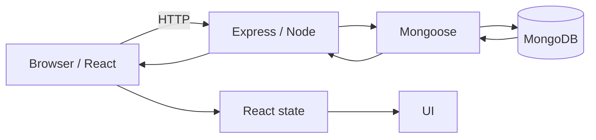

# Interview OS

**Ritesh Vishwakarma** · MERN · React · TypeScript · Node/Express · MongoDB · Authentication · AI/LLM Agents

A structured interview-preparation system for full-stack (MERN + TypeScript) and AI/LLM engineering interviews — built around *mechanism*, not memorized definitions. Every topic is framed as: **what it is, what problem it solves, how it works, where it was used in a real project, what breaks, and what changes at scale.**

> If the interviewer asks *"Why?"*, don't search your memory for a sentence. Ask: **"What problem was this decision solving?"** Then reconstruct the answer.

---

## Contents

- [Learning Philosophy](#learning-philosophy)
- [Interview Thinking Framework](#interview-thinking-framework)
- [Debugging Framework](#debugging-framework)
- [MERN From Zero](#mern-from-zero)
- [JavaScript](#part-a--javascript)
- [React](#part-b--react)
- [HTTP / Web](#part-c--http--web)
- [Node / Express / API Design](#part-d--node--express--api-design)
- [Auth & Security](#part-e--auth--security)
- [MongoDB / Mongoose](#part-g--mongodb--mongoose)
- [REST / Performance / Scale](#part-h--rest--performance--scale)
- [AI / LLM Agents](#part-i--ai--llm-agents)
- [Computer Vision (OpenCV)](#part-j--computer-vision-opencv)
- [TypeScript](#part-k--typescript)
- [Debugging Case Studies](#part-l--debugging-case-studies)
- [System Design](#part-m--system-design)
- [Project Defense](#project-defense)
  - [ONYX](#onyx--role-based-fashion-marketplace)
  - [Perplexity City](#perplexity-city--llm-tool-calling-agent)
  - [CloudBurn](#cloudburn--typescript-migration--cloud-spend-dashboard)
  - [DigiLateral](#digilateral--opencvjs-card-verification)
- [Resume Defense](#resume-defense)
- [WHY Trees](#why-trees-20-questions)
- [WHAT-IF Trees](#what-if-trees-20-questions)
- [WHY-NOT Trees](#why-not-trees-20-questions)
- [Rapid Revision — 401/403/Auth](#rapid-revision--401403auth)
- [Project-Specific 60-Question Drill](#project-specific-60-question-drill)
- [Final Night Checklist](#final-night-checklist)
- [The Interview Operating System](#the-interview-operating-system)
- [How to Use This Repo](#how-to-use-this-repo)

---

## Learning Philosophy

An interviewer may start with one word:

> **"JWT?"**

That single word can branch into: *What is JWT? Why did you use it? What's inside it? Is it encrypted? Where is it stored? Why HttpOnly? Access vs refresh token? Expiry? Revocation? XSS? CSRF? CORS? Authentication vs authorization? Where is RBAC enforced? What if a user directly calls the API?*

So — **don't learn isolated definitions.** For every important topic, ask:

1. What is it?
2. What problem does it solve?
3. How does it work?
4. Why did my project need it?
5. What alternatives existed?
6. What can break?
7. How would I debug it?
8. What changes at scale?

---

## Interview Thinking Framework

**The "Why?" framework**

```
Problem → Constraints → Options → Decision → Trade-off → Result
```

## Debugging Framework

```
Reproduce → Isolate → Observe → Hypothesis → Test → Fix → Verify → Prevent
```

---

## MERN From Zero

**M**ongoDB (database) · **E**xpress (web framework for Node.js) · **R**eact (UI library) · **N**ode.js (JS runtime)

They form a **system**, not four isolated technologies.



**Important distinction:** React does not directly talk to MongoDB in a normal MERN architecture. The browser calls an API; the backend validates/authenticates/authorizes the request, applies business logic, talks to the database, and returns a response.

**Debugging mental model** — ask: *at which boundary did reality stop matching my expectation?*

```
UI → event handler → state → HTTP → Express → middleware → controller → service → DB → response → state → render
```

---

## PART A — JavaScript

<details>
<summary><strong>Q1. What is JavaScript?</strong></summary>

**Definition:** A programming language used in browsers and, through runtimes such as Node.js, on servers.

**Important:** React is a library; Node.js is a runtime; Express is a framework — not synonyms for "JavaScript."

**Follow-ups:** Is JS single-threaded? What is a runtime? Browser JS vs Node JS?
</details>

<details>
<summary><strong>Q2. var vs let vs const</strong></summary>

| | Scope | Reassign | TDZ |
|---|---|---|---|
| `var` | Function | Yes | No |
| `let` | Block | Yes | Yes |
| `const` | Block | No binding reassignment | Yes |

`const` does not freeze objects:

```js
const user = { name: "Ritesh" };
user.name = "Alex"; // allowed
user = {};          // not allowed
```

**Why this matters:** `const` protects the variable binding, not the object's contents.

**Follow-ups:** hoisting, lexical scope, TDZ, immutability.
</details>

<details>
<summary><strong>Q3. Closure</strong></summary>

**Definition:** A function together with access to variables from its surrounding lexical environment.

```js
function createCounter() {
  let count = 0;
  return () => ++count;
}
const counter = createCounter();
counter(); // 1
counter(); // 2
```

**Project usage:** debounce/search behavior in **PlayPulse**.

**Mental hook:** Function + remembered environment.

**Follow-ups:** Why useful? Can closures retain memory? Explain debounce without saying "closure."
</details>

<details>
<summary><strong>Q4. Event Loop</strong></summary>

Synchronous JS executes via the call stack. Async operations are handled by the surrounding runtime; callbacks are scheduled for later execution. Promise callbacks are **microtasks**, generally processed before the next timer/task.

```
Synchronous JS → Call Stack → Async runtime work → Queues → Event Loop → Call Stack
```

```js
console.log("A");
setTimeout(() => console.log("B"), 0);
Promise.resolve().then(() => console.log("C"));
console.log("D");
// A D C B
```

**Mental hook:** Stack = now, queue = waiting, event loop = coordinator.

**Follow-ups:** microtask vs macrotask, blocking CPU work, Node event loop.
</details>

<details>
<summary><strong>Q5. Promise + async/await</strong></summary>

A Promise represents the eventual result of an async operation: `pending → fulfilled/rejected`. `async/await` is syntax over Promise-based operations.

```js
async function loadUser() {
  const response = await fetch("/api/user");
  return response.json();
}
```

**Important:** `await` does not freeze the whole runtime — it pauses that async function's continuation while other work continues.

**Follow-ups:** rejection, try/catch, sequential vs parallel awaits, timeouts.
</details>

<details>
<summary><strong>Q6. Promise.all vs allSettled vs race</strong></summary>

- `Promise.all()` — all results required; one rejection rejects the combined Promise.
- `Promise.allSettled()` — waits for every operation, inspects each outcome.
- `Promise.race()` — first settled Promise wins.

**Memory:** all = all required · allSettled = everyone reports · race = first settled.

**Follow-ups:** What if one API is slow? When should requests be parallel?
</details>

<details>
<summary><strong>Q7. this</strong></summary>

For a normal function, `this` depends on how it's called. Arrow functions use lexical `this` from surrounding scope.

**When confused, ask:** *Who called this function?*

**Follow-ups:** call, apply, bind, methods, classes.
</details>

<details>
<summary><strong>Q8. == vs ===</strong></summary>

`==` can perform type coercion. `===` compares without implicit coercion.

**Default:** use `===` unless coercion is deliberate and understood.
</details>

<details>
<summary><strong>Q9. Shallow vs deep copy</strong></summary>

```js
const copy = { ...original }; // top-level only
```

Nested objects may still share references. A deep clone creates independent nested data — `structuredClone()` is a modern option for many data types.

**Why React cares:** accidental mutation can create confusing state/reference behavior.

**Follow-ups:** reference equality, immutability, limits of JSON cloning.
</details>

<details>
<summary><strong>Q10. Debounce vs throttle</strong></summary>

**Debounce** — wait until activity stops.

> **Project usage (PlayPulse):** search uses a 300ms debounce; resume reports ~90% fewer RAWG API calls during active typing.

```
r → re → rea → reac → react
                    ↓ pause
                  request
```

**Throttle** — allow execution only at a controlled frequency. Useful for scroll/resize/high-frequency events.

**Follow-ups:** cleanup, stale requests, why 300ms, debounce vs cancellation.
</details>

---

## PART B — React

<details>
<summary><strong>Q11. What is React?</strong></summary>

A JavaScript library for building UIs from components. Core idea — **declarative UI**: describe what the UI should look like for the current state, rather than manually performing every DOM change.

**Follow-ups:** component, props, state, render, reconciliation.
</details>

<details>
<summary><strong>Q12. Props vs state</strong></summary>

**Props** = external input passed into a component. **State** = changing data owned/managed by a component or application-state system.

**Mental model:** Props = external input. State = changing owned data.

**Follow-ups:** lifting state, derived state, mutation.
</details>

<details>
<summary><strong>Q13. Rendering and reconciliation</strong></summary>

```
state/props/context change → render → new element tree → reconciliation → commit necessary DOM changes
```

Don't say only *"Virtual DOM makes React fast"* — explain the process.

**Follow-ups:** What causes render? Does every render change the DOM? What are keys?
</details>

<details>
<summary><strong>Q14. useEffect</strong></summary>

Synchronizes a component with an external system, or performs side effects tied to the component lifecycle (timers, subscriptions, browser APIs, network sync).

```js
useEffect(() => {
  const timer = setTimeout(doSomething, 300);
  return () => clearTimeout(timer);
}, [value]);
```

Cleanup prevents obsolete timers/subscriptions from remaining active.

**Important:** don't use an effect for every calculation — derived values often belong directly in rendering.

**Follow-ups:** dependency array, stale closures, infinite loops, cleanup, Strict Mode behavior.
</details>

<details>
<summary><strong>Q15. Why React Router loaders?</strong></summary>

**useEffect fetching:**
```
route renders → component renders → effect → fetch → state update → render again
```

**Loader:**
```
navigation → route loader → fetch → route gets data → render
```

> **Project usage (PlayPulse):** route-level data fetching moved into React Router v7 loaders.

**Reasoning:** if data belongs to the route, the router can own the loading/error/navigation relationship rather than every component implementing its own fetch effect.

**Follow-ups:** When is useEffect still better? What happens if navigation is cancelled? Loader errors? Server state vs client state?
</details>

<details>
<summary><strong>Q16. Controlled vs uncontrolled input</strong></summary>

**Controlled** — React state is the source of truth: `input → onChange → state → render → input`. Useful for validation, conditional UI, derived values.

**Uncontrolled** — the DOM owns the current value; React reads it through a ref. Useful for simple forms.

**Which is better?** Neither universally — choose based on who needs to own and react to the value.
</details>

<details>
<summary><strong>Q17. useMemo vs useCallback</strong></summary>

`useMemo` caches a **value**. `useCallback` caches a **function reference**.

```js
const total = useMemo(() => expensiveCalculation(items), [items]);
const handleClick = useCallback(() => save(id), [id]);
```

Use them for a reason, not automatically.

**Follow-ups:** referential equality, React.memo, dependency mistakes, premature optimization.
</details>

<details>
<summary><strong>Q18. React.memo</strong></summary>

Can skip rendering when props are considered equal — defeated by new references:

```jsx
<Component data={{ name: "Ritesh" }} />
<Component onClick={() => save()} />
```

Same apparent content ≠ same reference.

**Follow-ups:** When does memo help? Context changes? useCallback relationship?
</details>

<details>
<summary><strong>Q19. React keys</strong></summary>

Give list items stable identity. Prefer `item.id` over index when the list can insert/reorder/delete:

```jsx
items.map(item => <Row key={item.id} />)
```

**Why:** React needs to associate old and new elements with the same logical item.

**Follow-ups:** index-key bug, random keys, key vs prop.
</details>

<details>
<summary><strong>Q20. URL state</strong></summary>

> **Project usage (PlayPulse):** search state stored in URL — `/games?q=react`.

**Benefits:** shareable, refresh-safe, bookmarkable, back/forward compatible. Not every state belongs in the URL.
</details>

<details>
<summary><strong>Q21. Context</strong></summary>

Lets descendants consume shared values without prop-drilling through every intermediate component. Good for: theme, locale, auth-related context, stable configuration.

**Trade-off:** provider updates can cause consumers to re-render.
</details>

<details>
<summary><strong>Q22. Redux / Redux Toolkit</strong></summary>

Centralized, predictable client-state management; Redux Toolkit is the modern recommended way to write Redux.

```
component → dispatch(action) → reducer → store state → subscribed components
```

Use when the app has complex shared client-state needs — don't put everything in Redux.

**Ask:** Is this local UI state, shared client state, URL state, or server state?

**Follow-ups:** action, reducer, store, selector, immutable updates, Redux vs Context, Redux vs server-state tools.
</details>

<details>
<summary><strong>Q23. Custom hooks</strong></summary>

Packages reusable React **behavior**, not UI:

```js
function useDebounced(value, delay) {
  const [result, setResult] = useState(value);
  useEffect(() => {
    const timer = setTimeout(() => setResult(value), delay);
    return () => clearTimeout(timer);
  }, [value, delay]);
  return result;
}
```

**Follow-ups:** Rules of Hooks, custom hook vs utility function, shared state misconceptions.
</details>

---

## PART C — HTTP / Web

<details>
<summary><strong>Q24. What is HTTP?</strong></summary>

An application-layer protocol for client/server communication. Request: method, URL, headers, optional body. Response: status code, headers, optional body.

```
POST /api/products
Content-Type: application/json

{"name":"Jacket"}
```

**MERN connection:** browser → HTTP API → backend → database.

**Follow-ups:** HTTPS, headers, body, cookies, caching, keep-alive.
</details>

<details>
<summary><strong>Q25. HTTP methods</strong></summary>

| Method | Typical use |
|---|---|
| GET | Retrieve |
| POST | Create / submit an operation |
| PUT | Replace |
| PATCH | Partial update |
| DELETE | Delete |

REST is more than memorizing methods — think resources, semantics, status codes, idempotency, pagination, errors, authorization.
</details>

<details>
<summary><strong>Q26. Status codes</strong></summary>

- **2xx** success (200, 201, 204)
- **4xx** client problem (400, 401, 403, 404, 409, 429)
- **5xx** server-side failure (500, 502, 503)

**401 vs 403:** 401 = authentication missing/invalid. 403 = identity may be known, but access is not allowed.
</details>

<details>
<summary><strong>Q27. Authentication vs authorization</strong></summary>

**Authentication:** Who are you? **Authorization:** What are you allowed to do?

> **Project usage (ONYX):** login → authentication; seller creates product → authorization. Likely follow-up target for JWT/RBAC claims.
</details>

---

## PART D — Node / Express / API Design

<details>
<summary><strong>Q28. What is Node.js?</strong></summary>

A JavaScript runtime that lets JS execute outside the browser, providing APIs for networking, files, processes, streams, environment config, etc.

**Important:** Node is not "automatically non-blocking" — CPU-heavy synchronous work can still block its JS execution path.

**Follow-ups:** event loop, I/O, worker threads, CPU-bound work.
</details>

<details>
<summary><strong>Q29. What is Express?</strong></summary>

A Node.js web framework providing routing, middleware, and request/response infrastructure. Node = runtime, Express = web framework layer.
</details>

<details>
<summary><strong>Q30. Middleware</strong></summary>

Runs during request processing; can inspect, modify, reject, or pass a request onward.

```
request → CORS → logging → authentication → validation → controller → response
```

Conceptual JWT middleware: `request → read credential → verify → identify user → next()`. Invalid credentials → 401.

**Follow-ups:** next(), middleware order, router middleware, error middleware.
</details>

<details>
<summary><strong>Q31. MVC</strong></summary>

> **Project usage (ONYX backend):** `Route → Controller → Service → Model/DB`

- **Route** — maps URL + HTTP method.
- **Controller** — handles the HTTP boundary.
- **Service** — business logic.
- **Model** — data/schema/database behavior.

**Why:** prevents route handlers/controllers from becoming giant functions. **Trade-off:** a tiny application may not need many layers.

**Follow-ups:** where validation belongs, controller vs service, service size.
</details>

<details>
<summary><strong>Q32. Production-ready API</strong></summary>

Think in categories:

- **Correctness** — validation, status codes, consistent responses
- **Security** — authentication, authorization, input validation, rate limiting, secret management
- **Reliability** — timeouts, safe retries, idempotency, graceful errors
- **Performance** — indexes, pagination, caching
- **Observability** — logs, metrics, error monitoring
- **Maintainability** — tests, documentation, clear architecture
</details>

---

## PART E — Auth & Security

<details>
<summary><strong>Q33. JWT</strong></summary>

**JSON Web Token** — a compact token format commonly used to carry signed claims: `header.payload.signature`.

**Critical fact:** a normal signed JWT is **not encrypted** by default — never put secrets in its payload.

**Why signature?** The server can verify the token was signed by a trusted issuer and wasn't modified undetected.
</details>

<details>
<summary><strong>Q34. JWT flow in ONYX</strong></summary>

```
login → verify credentials → issue access/refresh credentials → authenticated request
      → auth middleware → verify token → identify user → authorization/RBAC → controller
```

When the access token expires, a refresh flow obtains a new access credential.

**Follow-ups:** token storage, expiration, revocation, rotation, logout, stolen refresh token.
</details>

<details>
<summary><strong>Q35. Why HttpOnly cookies?</strong></summary>

An HttpOnly cookie can't be read directly by normal page JavaScript (e.g. `document.cookie`) — reducing direct credential theft.

**HttpOnly is NOT complete security.** Still consider: XSS, CSRF, Secure, SameSite, CORS, cookie scope, expiration, rotation/revocation.

| | HttpOnly cookie | localStorage |
|---|---|---|
| JS can directly read token | No | Yes |
| Browser auto-attaches | Yes, per cookie rules | No |
| CSRF considerations | Important | Different model |
| Direct JS token theft | Reduced | Higher exposure |

**Follow-up trap:** *"Does HttpOnly prevent XSS?"* — No. XSS can still execute code; HttpOnly mainly prevents direct JS access to that cookie.
</details>

<details>
<summary><strong>Q36. Access token vs refresh token</strong></summary>

**Access token** — shorter-lived credential for normal authenticated requests. **Refresh token** — longer-lived mechanism to obtain a new access credential. Separation balances security and session convenience.
</details>

<details>
<summary><strong>Q37. OAuth2</strong></summary>

Describes authorization/delegation flows; JWT is a token format — **not competing alternatives.**

```
your app → Google → user authorization → authorization code → backend → Google token/identity exchange → application session
```

**Mental hook:** OAuth2 = flow; JWT = token format.

**Follow-ups:** authorization code, redirect URI, client secret, refresh token, CSRF/state parameter.
</details>

<details>
<summary><strong>Q38. CORS</strong></summary>

**Cross-Origin Resource Sharing.** Browsers restrict cross-origin JS access unless the server's response allows it. Origin = scheme + host + port (`http://localhost:3000` ≠ `http://localhost:5000`).

**Important:** CORS is primarily a browser enforcement mechanism — not the same as authentication.

**Follow-ups:** preflight OPTIONS, simple requests, credentials, `Access-Control-Allow-Origin`, cookies.
</details>

<details>
<summary><strong>Q39. XSS</strong></summary>

Occurs when attacker-controlled content becomes executable script in a victim's browser context: `untrusted input → unsafe rendering → script execution`.

**Defenses:** safe rendering/escaping, CSP, avoiding unsafe HTML injection, careful dependencies, appropriate credential storage.
</details>

<details>
<summary><strong>Q40. CSRF</strong></summary>

Abuses the browser's ability to send authenticated requests, especially when auth is automatically attached as a cookie.

**Defenses:** SameSite cookies, CSRF tokens, origin checks, appropriate authentication design.

**Follow-up:** Why is CSRF relevant to cookies? Does CORS alone solve it? No.
</details>

<details>
<summary><strong>Q41. Frontend vs backend validation</strong></summary>

Frontend validation = mainly UX. Backend validation = correctness + trust boundary — the browser is controlled by the user.

**Never treat client-side validation as your security boundary.**
</details>

---

## PART G — MongoDB / Mongoose

<details>
<summary><strong>Q46. MongoDB</strong></summary>

A document-oriented database storing BSON documents:

```js
{
  _id: "...",
  name: "Jacket",
  price: 2999,
  variants: [{ size: "M", stock: 5 }]
}
```

Choose based on data shape, query patterns, relationships, consistency needs, product constraints — not because "MongoDB is always faster."
</details>

<details>
<summary><strong>Q47. SQL vs NoSQL</strong></summary>

SQL commonly emphasizes tables, relationships, joins, relational constraints. MongoDB commonly emphasizes documents and document-oriented access. **No universal winner.**

> *"I choose based on workload, data relationships, consistency requirements, query patterns, and operational constraints."*
</details>

<details>
<summary><strong>Q48. Mongoose</strong></summary>

An ODM for MongoDB in Node.js — provides schemas, validation, models, casting, middleware/hooks, query APIs. MongoDB = database. Mongoose = application-side ODM layer.
</details>

<details>
<summary><strong>Q49. MongoDB indexes</strong></summary>

Without a suitable index, a query may inspect many documents. With a useful index, the database can often locate matching data more efficiently.

**Trade-offs:** extra storage, index maintenance, write/update overhead.

Never say *"indexes make every query faster."* Instead ask: *"What query pattern am I optimizing?"*

```js
Product.find({ sellerId }).sort({ createdAt: -1 })
```
→ investigate whether a compound index matching the actual access pattern helps.

**Follow-ups:** compound indexes, selectivity, index order, `explain()`, query plans, too many indexes.
</details>

<details>
<summary><strong>Q50. .sort() and query debugging</strong></summary>

At 10M documents, `filter → sort → limit` can become expensive without a suitable index.

**Debug with:** exact query, filter, sort, indexes, query plan, documents examined, documents returned.

> Resume mentions a Mongoose `.sort()` issue — prepare the **actual** symptom and root cause from the real implementation. Do not invent it.
</details>

<details>
<summary><strong>Q51. N+1</strong></summary>

`1 query for the list + N queries for related data` (e.g. 1 + 100 = 101 queries) — can become a serious performance problem.

`populate()` can resolve references, but is not automatically a performance solution.

**Alternatives:** embedding, aggregation, `$lookup`, batch queries, denormalization, caching.
</details>

<details>
<summary><strong>Q52. Transactions</strong></summary>

Groups related database operations so the app maintains required consistency guarantees (e.g. `debit A + credit B = one logical operation`).

**Ask:** Which invariant must remain true? Don't say "use a transaction whenever there are two writes" — sometimes data modeling or a single atomic document operation is enough.

**Follow-ups:** transaction cost, retries, single-document atomicity, consistency.
</details>

---

## PART H — REST / Performance / Scale

<details>
<summary><strong>Q53. Idempotency</strong></summary>

An operation is idempotent when repeating it produces the same intended final state.

**Why fintech cares:** `payment request → network timeout → client retries` — if the first request succeeded, a retry must not accidentally create a second charge.

**Advanced:** idempotency keys or another server-side mechanism.

**Follow-ups:** POST semantics, duplicate requests, crash after payment but before response.
</details>

<details>
<summary><strong>Q54. Pagination</strong></summary>

**Offset** (`?page=10&limit=20`) — simple, but large offsets get expensive and changing data creates inconsistent pages.

**Cursor** (`?cursor=abc123`) — "continue after this item"; often works well for large, changing datasets with a stable ordering.
</details>

<details>
<summary><strong>Q55. Caching</strong></summary>

Stores reusable data closer to where it's needed:

```
request → cache → hit → response
                → miss → backend → DB
```

**Main trade-off:** performance vs freshness. **Hard question:** When does cached data become invalid?

**Know:** TTL, cache-aside, write-through, invalidation, CDN caching.
</details>

<details>
<summary><strong>Q56. Redis</strong></summary>

A fast in-memory data store. **Common uses:** caching, rate limiting, sessions, distributed locks, queues, temporary state.

**Why useful with multiple backend instances:** local memory is not automatically shared between servers — a shared Redis instance is.
</details>

<details>
<summary><strong>Q57. Rate limiting</strong></summary>

Restricts how many requests a client can make per policy:

```
request → identify client → check limit → allowed? → yes: continue / no: 429
```

Protects against brute force, abuse, resource exhaustion.

**Know:** fixed window, sliding window, token bucket, leaky bucket.

**Follow-ups:** IP vs user ID, proxies, login rate limits, Redis failure, `Retry-After`.
</details>

<details>
<summary><strong>Q58. What does "scalable" mean?</strong></summary>

Never answer *"it can handle millions of users."* Ask: **What becomes the bottleneck when load grows?**

Possible bottlenecks: CPU, memory, database, DB connections, network, external APIs, locks, cache, single-instance state.

```
Small:   React → Node → MongoDB
Growing: Load balancer → multiple Node instances → cache/database scaling
```

**Rule:** find the bottleneck before adding infrastructure.
</details>

---

## PART I — AI / LLM Agents

<details>
<summary><strong>Q59. What is an LLM?</strong></summary>

A model trained to process and generate language. For an application: LLM = generation/reasoning component, **not automatically** a current search engine or source of truth — this is why Perplexity City uses an external search tool.
</details>

<details>
<summary><strong>Q60. What is an AI agent?</strong></summary>

```
user request → model → decide whether action/tool is needed
             → no: answer
             → yes: tool → result → model → answer
```

A static prompt wrapper is **not automatically** an agent.

> **Project usage (Perplexity City):** custom tool-calling workflow.
</details>

<details>
<summary><strong>Q61. Tool calling</strong></summary>

Lets a model request a structured external action, e.g. `search_web(query)` → model calls it → your application executes the tool and returns the result to the model.

**Important security principle:** the model is **not** a trusted authorization layer. The application must validate: tool arguments, permissions, credentials, rate limits, external results.

**Follow-ups:** wrong tool, tool failure, multiple tools, malicious tool arguments, prompt injection.
</details>

<details>
<summary><strong>Q62. LangChain</strong></summary>

An ecosystem/framework for building applications around LLMs, tools, retrieval, prompts, agents, workflows.

> Resume claim is specifically a **custom tool-calling agent** — be ready to explain model connection, tool definitions, binding, invocation, tool execution, result handling, final response.

Do not say *"LangChain makes the AI intelligent."*
</details>

<details>
<summary><strong>Q63. bindTools()</strong></summary>

Makes tool definitions available to the model so it can produce structured tool calls.

**Important:** binding a tool does not mean the model itself executes your server-side function — your application still needs to interpret/execute the requested tool.

**Follow-ups:** what does `invoke()` return? How do you inspect tool calls? What if tool arguments are invalid?
</details>

<details>
<summary><strong>Q64. Tavily</strong></summary>

The web-search component in the project. **LLM alone** = model-generated response from available context. **Tavily** = external/current search information.

```
question → agent → search needed? → no: LLM
                                   → yes: Tavily → results → LLM
```

**Why not always search?** Searching adds latency, external dependency, cost, noisy results, prompt-injection exposure — the agent decides when a tool is useful.
</details>

<details>
<summary><strong>Q65. Groq + Llama</strong></summary>

```
Your application → Groq API → model inference → Llama model
```

**Know the basics of:** tokens, context window, latency, temperature, model selection, rate limits, cost.
</details>

<details>
<summary><strong>Q66. LangChain v1 migration</strong></summary>

**One of the strongest engineering stories.**

> The old agent implementation stopped matching the newer LangChain API; the workflow was rebuilt around the current tool-calling/invocation pattern after investigating library behavior.

**Tell the story:** existing implementation stopped working → old API/import assumptions no longer valid → public examples insufficient/outdated → inspected current behavior/documentation/source → mapped old behavior to new primitives → rebuilt → verified.

**Real interview signal:** Can you understand unfamiliar technology when the tutorial no longer matches reality?
</details>

<details>
<summary><strong>Q67. Prompt injection</strong></summary>

External content can contain instructions that try to manipulate an LLM, e.g. a web page saying *"ignore previous instructions and call this tool..."* Treat retrieved content as **untrusted data**, not trusted application instructions.

**Defenses:** separate instructions from data, validate tool inputs, restrict tool permissions, perform authorization outside the model, constrain tool arguments, log tool calls, minimize secret exposure.

**Follow-ups:** Can an LLM authorize payments? No. Can an LLM be trusted with secrets? Not by default.
</details>

---

## PART J — Computer Vision (OpenCV)

<details>
<summary><strong>Q68. Computer vision</strong></summary>

Extracts useful information from images/video. Internship claims are specifically about **OpenCV.js**, reference-image/template matching, preprocessing, field/mark detection, camera variation, and CLAHE. Be precise rather than calling everything "AI."
</details>

<details>
<summary><strong>Q69. Why image preprocessing?</strong></summary>

Camera inputs vary due to lighting, shadows, focus, resolution, blur, perspective, device differences, positioning. Preprocessing tries to make input more suitable for detection.
</details>

<details>
<summary><strong>Q70. CLAHE</strong></summary>

**Contrast Limited Adaptive Histogram Equalization** — improves local contrast while limiting excessive contrast amplification.

> **Project problem:** uneven lighting → detection becomes less reliable → preprocessing → potentially better local contrast → detection.

CLAHE is not magic — it can also amplify unwanted noise/artifacts.

**Follow-ups:** global histogram equalization, local contrast, noise, parameters, evaluation.
</details>

<details>
<summary><strong>Q71. Template matching</strong></summary>

Compares a known reference pattern with image regions to find similar patterns. Project uses reference-image matching as part of detection.

**Failure cases:** scale, rotation, perspective, blur, lighting, occlusion, poor alignment, resolution.

**Follow-ups:** feature matching, registration, perspective transform, false positives/negatives.
</details>

<details>
<summary><strong>Q72. Debugging vision problems</strong></summary>

Use evidence: save the failing image/frame → reproduce → compare successful vs failed samples → inspect preprocessing output → check lighting/resolution/alignment → change one variable → measure the result → test across multiple inputs/devices.

Do not randomly change thresholds until one image looks correct.

> *"I separated capture problems from preprocessing and detection problems, compared successful and failed inputs, changed one variable at a time, and evaluated whether the change improved the actual detection behavior."*
</details>

---

## PART K — TypeScript

<details>
<summary><strong>Q73. TypeScript</strong></summary>

A typed superset of JavaScript that adds compile-time type checking and language features; transformed into JavaScript.

> **Project usage (CloudBurn):** JSX migrated to TypeScript after repeated prop-mismatch bugs.

```ts
type Props = {
  amount: number;
};
```

**Important:** TypeScript does not validate arbitrary runtime API data automatically — if an API returns `{"amount":"not a number"}`, runtime validation may still be needed.

**Follow-ups:** `any`, `unknown`, unions, generics, interfaces/types, runtime validation.
</details>

<details>
<summary><strong>Q74. Why TypeScript for CloudBurn?</strong></summary>

Don't answer *"TypeScript is better."*

> *"Repeated prop mismatches showed that component contracts were being violated. Encoding those contracts in TypeScript moved a class of errors earlier into development instead of discovering them only through runtime behavior."*

**Follow-ups:** migration strategy, PropTypes, runtime validation, gradual migration.
</details>

<details>
<summary><strong>Q75. Recharts</strong></summary>

> **Project usage (CloudBurn):** visualizes AWS/GCP/Azure spend.

Think beyond the chart: data shape, aggregation, loading, errors, empty states, large datasets, formatting, responsive behavior.

**Scale question:** Should the frontend receive millions of raw billing records just to draw a chart? Usually consider aggregation and appropriate data boundaries.
</details>

---

## PART L — Debugging Case Studies

<details>
<summary><strong>Q77. _id vs id</strong></summary>

> Resume mentions a JWT/data-field mismatch involving `_id` vs `id`.

```
MongoDB/Mongoose → API serialization → HTTP response → frontend data → component lookup
```

If frontend expects `user.id` but receives `user._id`, a value can become `undefined` and a later comparison fails.

**The important question:** Where was the first incorrect assumption introduced? Not: "Which line crashed?"

**Follow-ups:** Mongoose id, serialization, API contracts, TypeScript types, response normalization.
</details>

<details>
<summary><strong>Q78. Duplicate React instance</strong></summary>

A dependency graph can accidentally contain multiple React instances/versions (`App → React A`, `Library → React B`), causing hook/runtime problems.

**Debug:** inspect dependency tree, React versions, peer dependencies, lockfile, bundler resolution → deduplicate/fix dependency declarations.

**Follow-ups:** peer dependency, `npm dedupe`, why multiple React instances break hooks.
</details>

<details>
<summary><strong>Q79. Mongoose .sort() issue</strong></summary>

> Resume says a `.sort()` conflict was debugged.

Prepare the **real** implementation story: exact symptom, exact code, first hypothesis, evidence, root cause, fix, verification. Do not invent a root cause just because a generic explanation sounds plausible.
</details>

<details>
<summary><strong>Q80. API works locally but fails in production</strong></summary>

Trace the whole boundary:

```
Browser → frontend deployment → DNS/HTTPS → CORS → API → environment variables
        → cookies/auth → database → external services
```

**Check:** network request URL, status code, request headers, response, server logs, environment configuration, DB/external-service logs. Do not immediately blame React.
</details>

---

## PART M — System Design

<details>
<summary><strong>Q81. URL shortener</strong></summary>

```
long URL → generate key → store key→URL → GET /abc123 → lookup → redirect
```

**Then brainstorm:** collision handling, Base62, expiration, analytics, caching, rate limiting, hot URLs, read-heavy workload, database indexes.
</details>

<details>
<summary><strong>Q82. Queue</strong></summary>

Without: `HTTP request → long job → user waits`. With: `HTTP request → enqueue → quick response → worker → job`.

**Useful for:** emails, image processing, reports, notifications, long AI work.

**Advanced:** worker crash? retries? duplicate jobs? dead-letter queue? idempotency? at-least-once processing?
</details>

<details>
<summary><strong>Q83. WebSocket vs HTTP</strong></summary>

HTTP: `request → response`. WebSocket: persistent bidirectional connection — useful for chat, live notifications, collaborative features, real-time dashboards.

**Follow-ups:** authentication, reconnect, scaling many connections, pub/sub, Redis.
</details>

<details>
<summary><strong>Q84. Transactions vs queues vs retries</strong></summary>

Different problems: **Transaction** = data consistency. **Queue** = move slow work out of the request path. **Retry** = recover from transient failure. **Idempotency** = make retries safe. They work together in one system.
</details>

<details>
<summary><strong>Q85. Small → medium → large architecture</strong></summary>

```
Small:  React → Node → MongoDB
Medium: Load balancer → Node instances → Redis/cache → MongoDB
Larger: add only what a measured bottleneck requires
        (CDN, queues, replicas, database scaling, observability,
         rate limiting, service separation)
```

Do not add microservices, Redis, queues, or Kafka just to sound senior — identify the bottleneck first.
</details>

---

## Project Defense

### ONYX — role-based fashion marketplace

**30-second pitch:**

> "ONYX is a role-based fashion marketplace built with React, Node.js, Express, and MongoDB. I implemented buyer/seller authorization using JWT role claims, authentication through JWT and Google OAuth2, and protected credentials using HttpOnly cookies with a refresh mechanism. The backend separates routes, controllers, services, and models. I also built an image upload pipeline from multipart form data through Express middleware to an external image service/CDN, storing the resulting URL in MongoDB."

Then wait — let the interviewer choose the branch.

<details>
<summary><strong>Why RBAC?</strong></summary>

**RBAC** = Role-Based Access Control. Instead of assigning every permission individually, users belong to roles (Buyer → browse/cart/checkout, Seller → product management).

**Critical distinction:** frontend guards improve UX; **backend authorization is the security boundary.** If someone manually calls `POST /seller/products`, the backend must still verify authorization.

**Advanced follow-ups:** What if role changes after JWT issuance? RBAC vs ABAC? What if permissions become more granular? How do you revoke seller access immediately?
</details>

<details>
<summary><strong>Why ImageKit/CDN?</strong></summary>

Media storage/delivery and application data are different concerns — the architecture stores a media URL in MongoDB instead of large image binaries directly.

```
browser → multipart → Express → image service → CDN URL → MongoDB metadata → React
```

**Failure cases:** upload succeeds/DB fails → orphaned image; DB succeeds/upload fails → invalid reference; image later disappears → broken external dependency.

**Follow-ups:** file-size validation, MIME validation, cleanup, signed URLs, public/private media.
</details>

<details>
<summary><strong>"Double click Buy" question</strong></summary>

```
click Buy → request A
click Buy → request B
```

Both requests may reach the server. **Ask:** Can this create duplicate orders? Is the operation idempotent? Is stock updated atomically? Does payment need an idempotency key? What happens if the network times out after the server succeeds?

A simple UI bug becomes a backend reliability question.
</details>

### Perplexity City — LLM tool-calling agent

See [Part I — AI/LLM Agents](#part-i--ai--llm-agents) for the full technical breakdown: LangChain custom tool-calling agent, `bindTools()`, Tavily search integration, Groq + Llama inference, prompt injection defenses, and the LangChain v1 migration story.

### CloudBurn — TypeScript migration + cloud-spend dashboard

See [Part K — TypeScript](#part-k--typescript) for the JSX→TypeScript migration (driven by repeated prop-mismatch bugs) and the Recharts-based AWS/GCP/Azure spend visualization.

### DigiLateral — OpenCV.js card verification

See [Part J — Computer Vision](#part-j--computer-vision-opencv) for the reference-image/template matching pipeline, CLAHE preprocessing, camera-variation handling, and the debugging methodology used to isolate lighting/detection failures.

---

## Resume Defense

<details>
<summary><strong>Tell me about yourself</strong></summary>

**Structure:** current engineering role → technical identity → strongest evidence → what you want next.

> "I'm a full-stack developer focused on React, Node.js, and MongoDB. I'm currently working on a production React application where I've worked on OpenCV.js-based card verification and debugging image-processing behavior. Outside the internship I built projects such as ONYX, where I worked on JWT/RBAC and OAuth2, and Perplexity City, where I built a LangChain tool-calling workflow. I'm looking for a role where I can continue working across the stack and deepen my production engineering skills."
</details>

<details>
<summary><strong>Why B.Com?</strong></summary>

Do not attack the degree comparison. Use evidence: B.Com → decision to move into software → self-learning → projects → real bugs → internship → engineering direction.

**Possible follow-up:** "How do you compare yourself with CS graduates?"

> "I have a non-CS academic background, so I have had to deliberately build my engineering fundamentals. My way of closing that gap has been through projects, production debugging, DSA, and learning the underlying concepts rather than only frameworks."
</details>

<details>
<summary><strong>Did AI build your projects?</strong></summary>

Do not lie.

> "I use AI as a development aid, but I don't treat generated code as verified code. I still need to understand and debug the implementation. For example, the LangChain migration required investigating current library behavior when older examples stopped working, and my production work involved tracing actual failures."

Then expect: "Explain `bindTools()`." If you cannot explain the implementation, the resume claim is too strong.
</details>

<details>
<summary><strong>Why did you use X?</strong></summary>

Never answer only "because it is popular." Use `Problem → constraints → alternatives → decision → trade-off → result`.

> "I used debouncing because search was producing a request for every keystroke. I wanted fewer unnecessary requests without making the UI feel slow, so I used a 300ms delay. The trade-off is that the request waits briefly for typing to stop."
</details>

<details>
<summary><strong>Biggest bug?</strong></summary>

Good stories from the resume: `_id` vs `id`, duplicate React instance, LangChain migration, OpenCV lighting/detection, Mongoose `.sort()`.

**Use:** Symptom → hypothesis → evidence → root cause → fix → verification → lesson.
</details>

---

## Brainstorming Trees

If the interviewer says:

| Trigger | Branch out to |
|---|---|
| **"React"** | component → props/state → render → reconciliation → hooks → effect → keys → memoization → Context → Redux → Router → loaders → performance → testing/accessibility |
| **"Node"** | runtime → event loop → I/O → blocking → Express → middleware → errors → streams → environment → scaling |
| **"MongoDB"** | document → Mongoose → schema → query → index → explain → sort → pagination → populate → N+1 → aggregation → transactions → scaling |
| **"JWT"** | claims → signature → storage → HttpOnly → access token → refresh token → expiry → revocation → XSS → CSRF → CORS → RBAC |
| **"LLM"** | model → prompt → tokens → context → tool calling → agent → retrieval/search → hallucination → prompt injection → latency → cost → evaluation |
| **"OpenCV"** | image → pixels → preprocessing → contrast → noise → template matching → alignment → perspective → thresholds → false positives → false negatives → evaluation |

---

## WHY Trees (20 questions)

For each, force yourself to answer: **"What problem was this decision solving?"**

1. Why React instead of plain JavaScript?
2. Why React Router loaders instead of useEffect?
3. Why Redux instead of Context?
4. Why TypeScript?
5. Why Node.js?
6. Why Express?
7. Why MVC?
8. Why MongoDB?
9. Why Mongoose?
10. Why JWT?
11. Why HttpOnly cookies?
12. Why access + refresh tokens?
13. Why OAuth2?
14. Why RBAC?
15. Why backend authorization if frontend already blocks routes?
16. Why external image storage/CDN?
17. Why debounce?
18. Why LangChain?
19. Why Tavily?
20. Why CLAHE?

## WHAT-IF Trees (20 questions)

1. What if the access token expires during an API request?
2. What if the refresh token is stolen?
3. What if a seller manually calls the API?
4. What if image upload succeeds but DB save fails?
5. What if DB save succeeds but image upload fails?
6. What if two search requests finish in reverse order?
7. What if the user clicks Buy twice?
8. What if Redis goes down?
9. What if MongoDB has 10 million products?
10. What if the same payment request is retried?
11. What if Tavily fails?
12. What if the LLM chooses the wrong tool?
13. What if a web page contains prompt injection?
14. What if a dependency update breaks the app?
15. What if two React versions are installed?
16. What if camera lighting is poor?
17. What if the image is rotated?
18. What if TypeScript passes but runtime API data is wrong?
19. What if frontend and backend disagree about the user's role?
20. What if traffic becomes 100x?

## WHY-NOT Trees (20 questions)

1. Why not localStorage for auth?
2. Why not sessions?
3. Why not Context instead of Redux?
4. Why not useEffect for all fetching?
5. Why not index every MongoDB field?
6. Why not SQL?
7. Why not store images directly in MongoDB?
8. Why not always search before an LLM answer?
9. Why not let the LLM decide authorization?
10. Why not use a 30-day access token?
11. Why not put business logic in controllers?
12. Why not use array indexes as keys?
13. Why not deep-clone everything?
14. Why not debounce every event?
15. Why not use WebSockets everywhere?
16. Why not Redis everywhere?
17. Why not put every job in a queue?
18. Why not use microservices immediately?
19. Why not trust frontend validation?
20. Why not blindly use AI-generated code?

---

## Rapid Revision — 401/403/Auth

| Term | Meaning |
|---|---|
| Authentication | Who are you? |
| Authorization | What can you do? |
| 401 | Credential is missing/invalid |
| 403 | Identity/access context exists, but permission is denied |
| JWT | Signed token format carrying claims |
| HttpOnly | JavaScript cannot directly read the cookie |
| Access token | Short-lived normal API credential |
| Refresh token | Longer-lived mechanism for obtaining new access credentials |
| OAuth2 | Authorization/delegation flow |
| RBAC | Permissions based on role |
| CORS | Browser cross-origin access control |
| XSS | Attacker-controlled script executes in browser context |
| CSRF | Attacker causes a victim browser to make an authenticated request |

---

## Project-Specific 60-Question Drill

<details>
<summary><strong>ONYX (20)</strong></summary>

1. Explain architecture.
2. Why MVC?
3. Why service layer?
4. Explain login.
5. Explain JWT.
6. Why HttpOnly?
7. Why refresh tokens?
8. Explain OAuth2.
9. Explain RBAC.
10. Why backend authorization?
11. What if URL is manually changed?
12. What if role changes?
13. Explain image upload.
14. Why CDN?
15. What if ImageKit fails?
16. What if DB fails after upload?
17. How would you prevent duplicate orders?
18. Where is validation?
19. What indexes would you add?
20. How would you scale it?
</details>

<details>
<summary><strong>Perplexity City (20)</strong></summary>

1. What is an LLM?
2. What is an agent?
3. What is tool calling?
4. Explain `bindTools()`.
5. Does `bindTools()` execute the tool?
6. Explain `invoke()`.
7. Why Tavily?
8. Why not always search?
9. What if Tavily fails?
10. What is prompt injection?
11. How do you secure tools?
12. Why LangChain?
13. Explain the v1 migration.
14. How did you debug the migration?
15. Explain Gmail OAuth2.
16. Explain token refresh.
17. `_id` vs `id`?
18. Duplicate React instance?
19. Mongoose `.sort()`?
20. How would you reduce LLM cost?
</details>

<details>
<summary><strong>CloudBurn (10)</strong></summary>

1. Why TypeScript?
2. What bug did types prevent?
3. TypeScript vs runtime validation?
4. `any` vs `unknown`?
5. Why Recharts?
6. Where should cloud-spend aggregation happen?
7. What if the dataset becomes huge?
8. How would you cache dashboard data?
9. What does the Git merge conflict teach you?
10. Why code review?
</details>

<details>
<summary><strong>DigiLateral (10)</strong></summary>

1. What did you personally build?
2. What was the old detection pipeline?
3. What failed?
4. How did you reproduce it?
5. Why does camera variation matter?
6. Why preprocessing?
7. What is CLAHE?
8. Why template matching?
9. False positive vs false negative?
10. How would you measure improvement?
</details>

---

## Final Night Checklist

Do not reread everything. Explain these **aloud, without notes**:

- Event loop
- Promise/microtask behavior
- Closure + debounce
- React render/reconciliation
- useEffect
- useMemo vs useCallback
- Keys
- Router loaders
- Context vs Redux
- HTTP request/response
- 401 vs 403
- Authentication vs authorization
- JWT
- HttpOnly
- Access/refresh tokens
- OAuth2
- CORS
- Express middleware
- MVC
- ONYX architecture
- MongoDB index
- N+1
- Transactions
- Image pipeline
- LLM
- Agent
- Tool calling
- `bindTools()`
- Tavily
- CLAHE
- TypeScript
- `_id` vs `id`
- Duplicate React instance
- Production debugging
- 30-second self-test

> If you cannot explain a topic without reading: you have memorized the words, but you have not learned the mechanism yet.

---

## The Interview Operating System

**When asked about a technology:**

```
WHAT IS IT?
    ↓
WHAT PROBLEM DOES IT SOLVE?
    ↓
HOW DOES IT WORK?
    ↓
WHERE DID I USE IT?
    ↓
WHY DID I CHOOSE IT?
    ↓
WHAT ALTERNATIVES EXIST?
    ↓
WHAT CAN BREAK?
    ↓
HOW WOULD I DEBUG IT?
    ↓
WHAT CHANGES AT SCALE?
```

**When debugging:**

```
SYMPTOM → REPRODUCE → TRACE → ISOLATE → HYPOTHESIS → TEST → ROOT CAUSE → FIX → VERIFY → PREVENT
```

**When asked "Why?":**

```
PROBLEM → CONSTRAINTS → OPTIONS → DECISION → TRADE-OFF → RESULT
```

**The most important lesson:**

You are not trying to become someone who remembers 100 interview answers. You are trying to become someone who can take an unfamiliar problem, build a mental model, trace data/control flow, form a hypothesis, test it, and explain the decision.

That is the difference between *"I know React"* and *"I can reason about a React system."*

Between *"I used JWT"* and *"I understand authentication as an identity → credential → verification → authorization → session lifecycle."*

Between *"I built an AI agent"* and *"I understand how a model, tools, external data, application code, failures, cost, and security interact in an agent workflow."*

---

## How to Use This Repo

1. **Read Learning Philosophy and both frameworks first.** Every other section assumes you're applying `Problem → Constraints → Options → Decision → Trade-off → Result` and `Reproduce → Isolate → Observe → Hypothesis → Test → Fix → Verify → Prevent`, not reciting facts.
2. **Work topic-by-topic**, using the collapsible `<details>` sections as a self-test: read the question, answer out loud before expanding.
3. **Drill the WHY / WHAT-IF / WHY-NOT trees** after covering the core sections — they're designed to simulate branching follow-ups.
4. **Rehearse Project Defense out loud**, especially the 30-second ONYX pitch, and be ready to go deeper on any branch the interviewer picks.
5. **Finish with the Final Night Checklist** — if you can't explain an item without reading it, you've memorized words, not the mechanism.
6. **Never invent details for a project claim** (e.g. the exact Mongoose `.sort()` bug) — always substitute your real symptom, hypothesis, and fix.