# JavaScript & TypeScript Internals — From Source Code to CPU

> This document teaches **systems thinking**, not syntax. Every section answers: *what component touches my code, what structure does it build, and what happens before/after it?*

---

## 0. The Big Picture

```
SOURCE CODE
   ↓
LANGUAGE / SYNTAX  (JavaScript or TypeScript)
   ↓
PARSER → AST
   ↓
TRANSFORMATION / COMPILATION  (tsc, Babel, bundler)
   ↓
JAVASCRIPT
   ↓
RUNTIME  (Browser or Node.js)
   ↓
JAVASCRIPT ENGINE  (V8, etc.)
   ↓
EXECUTION  (Call Stack, Execution Contexts)
   ↓
MEMORY + ASYNC + OPTIMIZATION
   ↓
CPU
```

**Vocabulary you must never blur together:**

| Term | What it actually is | What it is NOT |
|---|---|---|
| JavaScript | A language specification (ECMAScript) | Not an engine, not a runtime |
| JavaScript Engine (V8) | Software that parses, executes, and optimizes JS | Not Node.js, not a browser |
| JavaScript Runtime | An engine + host APIs (timers, I/O, DOM, network) | Not just the engine |
| Browser | A runtime/host: engine + DOM + Web APIs + renderer | Not "just V8" |
| Node.js | A runtime/host: engine + filesystem/network/module APIs | Not a compiler |
| Compiler | Translates source into another representation, may or may not execute it | — |
| Transpiler | A compiler whose output is still source-level code (JS → JS) | A separate category from "real" compilers — the line is fuzzy |
| Transformer | The AST-to-AST rewriting step inside a compiler pipeline | Not the whole pipeline |
| Bundler | Builds a module graph and emits deployable assets | Not a compiler, not a runtime |
| Babel | A JS-family source transformer (syntax in → JS out) | Does not execute code, does not type-check |
| TypeScript Compiler (`tsc`) | Parses, binds, type-checks, transforms, emits JS | Does not execute your program |

> **One sentence to remember:** *Build tools prepare JavaScript. The runtime hosts it. The engine executes it.*

---

## 1. JavaScript Internals

### 1.1 Execution Contexts, the Call Stack, and Lexical Environments

**Question:** What exactly gets created when a function is called?

**Mental model:** Every time code runs — globally or inside a function — the engine creates an **execution context**: bookkeeping for that piece of running code (its variables, its `this`, its outer scope reference).

**Behind the scenes:**

```
Execution Context
├── Lexical Environment   → environment record (bindings) + reference to outer environment
├── Variable Environment   → var/function bindings
├── this binding (where applicable)
└── other execution metadata
```

Function calls stack naturally, because a call must return to its caller:

```
one() calls two() calls three()

┌─────────┐
│ three() │ ← executing now
├─────────┤
│ two()   │
├─────────┤
│ one()   │
├─────────┤
│ global  │
└─────────┘
```

When `three()` finishes, its frame is popped and `two()` resumes exactly where it left off. This is why an uncontrolled recursive call produces a **stack overflow** — each call adds a frame until the stack's capacity is exhausted.

**Interview answer:** *"An execution context is the engine's runtime state for a piece of executing code — its variables, scope reference, and `this`. Function calls push a new context onto the call stack; JavaScript runs one job to completion before starting the next."*

> **Memory trick:** Call Stack = "who called whom, and where do I return to?"

### 1.2 Lexical Scope and Variable Lookup

**Question:** How does JavaScript know which `x` you mean?

Scope is decided by **where code is written**, not by who calls it. A lexical environment holds local bindings plus a pointer to its outer environment — a chain:

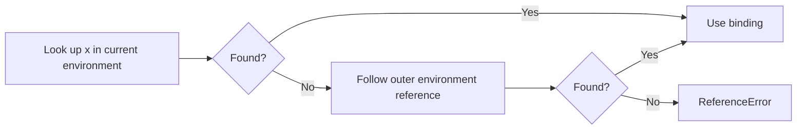

This chain — not the prototype chain — is what resolves a bare variable name. Keep the two mechanisms separate:

> **Scope chain = name lookup. Prototype chain = property lookup.** These are the two most confused mechanisms in JavaScript.

### 1.3 Hoisting and the Temporal Dead Zone

**Question:** Does JavaScript actually move declarations to the top?

Not literally — that's a teaching shortcut. What really happens: **bindings are created during environment setup**, before line-by-line execution begins, but different declaration kinds initialize differently.

```js
console.log(a); // undefined — binding exists, initialized to undefined
var a = 10;

console.log(b); // ReferenceError — binding exists but is in TDZ
let b = 10;
```

| Declaration | Binding created early? | Accessible before its line? |
|---|---|---|
| `var` | Yes | Yes → `undefined` |
| `let` / `const` | Yes | No → Temporal Dead Zone (TDZ) throws |
| `function` declaration | Yes, fully initialized | Yes → callable |

> **Memory trick:** *Hoisting isn't "code moves." It's "bindings exist before initialization does" — and `let`/`const` refuse to be read before they're initialized.*

### 1.4 Closures

**Question:** Why can an inner function access a variable after its outer function has already returned?

**Mental model:** A closure is not a snapshot/copy of variables. It's a function that **retains a live reference to its surrounding lexical environment.**

```js
function createCounter() {
  let count = 0;
  return function increment() {
    count++;
    return count;
  };
}

const counter = createCounter();
counter(); // 1
counter(); // 2
```

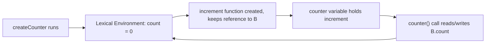

`createCounter()`'s frame is gone from the call stack, but its **environment** is still reachable — because `increment` references it. That's the whole trick: reachability, not stack lifetime, decides what survives.

**Engineer insight — closures and memory:** If a closure keeps a reference to a large object and that closure stays reachable (e.g., stored in a cache, attached as an event listener), the object it closes over cannot be garbage-collected. The debugging question is never "is this a closure leak" — it's:

```
What is still reachable from GC roots?
   → Which closure keeps it reachable?
   → Which listener/timer/cache holds that closure?
```

> **Memory trick:** *Closure = function + retained access to its lexical environment (not a copy).*

### 1.5 Functions, `this`, and Arrow Functions

**Question:** Why does `this` behave differently in an arrow function?

For an ordinary function, `this` is decided **by how the function is called** (the call-site), not where it's defined:

```js
const user = {
  name: "Ritesh",
  sayName() { console.log(this.name); }
};

user.sayName();        // "Ritesh" — this = user (call-site: obj.method())
const fn = user.sayName;
fn();                  // this is not user anymore — different call form
```

Arrow functions **never create their own `this`** — they capture `this` lexically from their enclosing scope, exactly like a normal variable:

```js
const obj = {
  name: "Ritesh",
  method() {
    const arrow = () => console.log(this.name); // reads `this` from method()
    arrow();
  }
};
```

`call`/`apply`/`bind` explicitly set the call-site `this` for ordinary functions; they have no such effect on arrow functions.

**Interview answer:** *"Ordinary functions get `this` from how they're called. Arrow functions have no `this` of their own — they close over the `this` of the enclosing lexical scope, same mechanism as any other closed-over variable."*

### 1.6 Objects and the Prototype Chain

**Question:** If `obj` doesn't define `toString`, why does `obj.toString()` work?


Property lookup checks the object's own properties first; if not found, it walks `[[Prototype]]` links until it hits `null`.

```
user.toString
  own property? no
  → prototype property? yes (Object.prototype.toString)
  → use it
```

**Important distinctions:**
- `obj.__proto__` is the *link to* an object's prototype (a live object).
- `Constructor.prototype` is the object that becomes the `[[Prototype]]` of instances created with `new Constructor()`.
- ES2015 `class` syntax is sugar over this same prototype mechanism — **JavaScript is prototype-based**, not class-based, even with `class` keywords.

> **Memory trick:** *Scope chain resolves names. Prototype chain resolves properties. Never merge the two.*

---

## 2. The JavaScript Engine (V8 as the Reference Example)

> Modern engines evolve constantly. Treat the pipeline below as a **conceptual model**, not a fixed permanent API.

### 2.1 Is JavaScript Interpreted or Compiled?

The question itself is slightly wrong: JavaScript is a **language**; ECMAScript defines semantics, not an execution strategy. Engines are free to interpret, JIT-compile, or blend both.

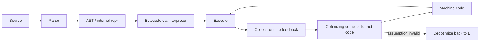

V8 documents an interpreter (Ignition) plus multiple optimizing compilation tiers; the exact tiers change between releases, so don't memorize specific compiler names as permanent architecture.

**Interview answer:** *"Interpreted vs compiled is an engine implementation detail, not a language property. Modern engines parse, run through a fast baseline path, collect feedback on real usage, then optimize hot code — and can bail back out if assumptions break."*

### 2.2 Hidden Classes / Shapes and Inline Caches

**Question:** Why does an object's structure affect performance?

JavaScript objects are dynamic, but engines want fast, statically-typed-like property access. V8 tracks an internal "shape" (hidden class) describing an object's property layout:

```
{}              → shape S0
  + name        → shape S1
  + age         → shape S2
```

Two objects built the same way (same properties, same order) share a shape:

```js
const a = { name: "A", age: 20 };
const b = { name: "B", age: 30 }; // same shape as a
```

An **inline cache** remembers "the last time I accessed `.name` on an object with shape S2, the property was at offset X" — so repeated access through a stable shape becomes cheap. Changing an object's shape after the fact (adding/deleting properties dynamically, or building similar objects with properties in different orders) can invalidate that assumption and force slower generic lookups, or a deoptimization of code that assumed the old shape.

> **Engineer insight:** Constructing all instances of a "record" type the same way (same properties, same order, ideally in a constructor) keeps shapes stable and access fast. This is not a rule to obsess over prematurely — it matters in hot loops over large data sets, not in one-off code.

### 2.3 JIT and Deoptimization

```js
function add(a, b) { return a + b; }
add(1, 2); add(10, 20);      // engine observes: numbers
add("hello", "world");        // assumption breaks
```

The engine optimizes `add` assuming numeric operands based on observed calls. Once it sees strings, code compiled under the numeric assumption is no longer valid — the engine **deoptimizes**, falling back to a slower path, and may re-optimize later based on new feedback.

> **Memory trick:** *JIT = compile based on what actually happened, not just what could happen. Deopt = the escape hatch when reality changes.*

---

## 3. Memory and Garbage Collection

**Question:** If JavaScript has garbage collection, how can memory leaks still happen?

**Mental model:** Nothing is deleted because a variable "goes out of scope" — that's an oversimplification. The real rule is **reachability**: an object can be reclaimed once nothing reachable from GC roots (globals, active stack frames, live closures) points to it anymore.


**How a "leak" actually happens** (nothing is technically broken — reachability is honored, just unintentionally):

```js
const cache = {};
function remember(key, value) { cache[key] = value; } // cache never shrinks
```

or an event listener that outlives the DOM node it was meant to serve, or a closure captured by a long-lived timer that references a large object.

**Debugging question that actually helps:**

```
What is still reachable from GC roots?
   → Which global / cache / listener / timer / closure holds it?
```

This is exactly what a heap snapshot + retainer path in DevTools shows you — not "how much memory," but **who is keeping this object alive.**

> **Memory trick:** *GC reclaims what's unreachable, not what's "unused." Leaks are accidental reachability, not broken garbage collection.*

---

## 4. Asynchronous JavaScript

### 4.1 The Core Question

```js
console.log("A");
setTimeout(() => console.log("B"), 0);
Promise.resolve().then(() => console.log("C"));
console.log("D");
```

Output:

```
A
D
C
B
```

**Behind the scenes — layer by layer:**

1. `console.log("A")` and `"D")` run synchronously, in order, as part of the current job on the call stack.
2. `setTimeout(..., 0)` doesn't run "in 0ms" — it hands a callback to the **host** (browser/Node), which schedules it as a **macrotask**, to run only after the current job finishes.
3. `Promise.resolve().then(...)` schedules its callback as a **microtask**.
4. When the current synchronous job finishes, the engine **drains the entire microtask queue** before touching the next macrotask.
5. So: sync code → all microtasks → next macrotask. That's why `C` (microtask) beats `B` (macrotask), even though both were "scheduled for later."

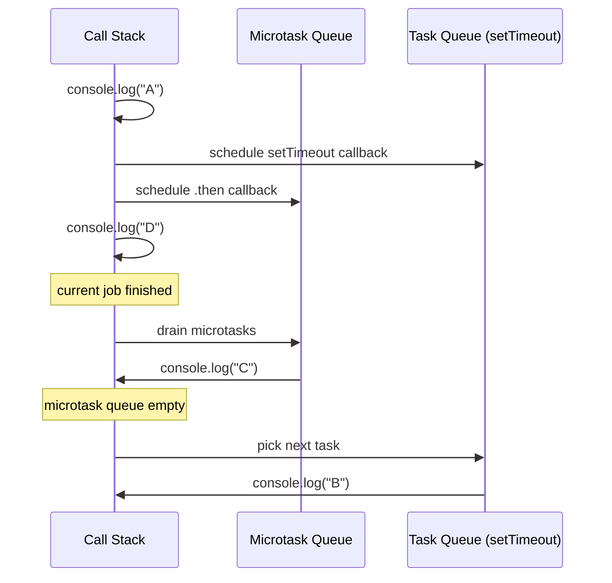

**Interview answer:** *"A job runs to completion. Once it finishes, the engine drains every pending microtask — Promise reactions — before moving to the next macrotask, like a timer or I/O callback. That ordering, not 'Promises are faster,' is why `.then()` beats `setTimeout(fn, 0)`."*

### 4.2 Does JavaScript Itself Perform Network Requests?

No. `fetch()` is a **host-provided API** (browser or Node's implementation), not part of the JavaScript language or the engine. The engine executes the JS that *calls* `fetch()`; the actual networking, timer, and file-system machinery live in the host.

```
Engine  = executes JavaScript
Host    = provides capabilities (network, timers, filesystem, DOM)
```

### 4.3 Does `await` Block the Runtime?

No. `await` suspends the **continuation of that one async function** — it does not freeze the call stack or other code.

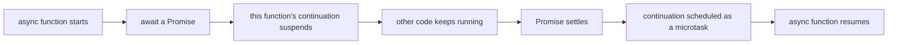

> **Memory trick:** *`await` pauses one function's continuation, not the whole engine.*

---

## 5. Browser Internals

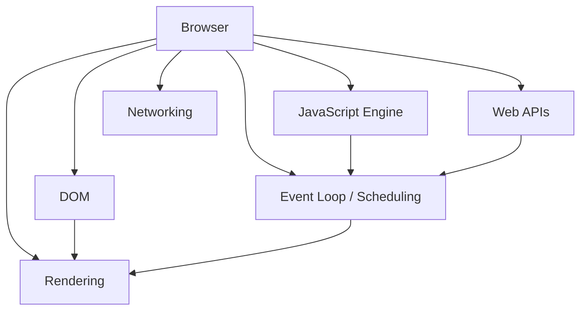

- **DOM is not the JavaScript AST.** Both are trees, but the AST represents *program syntax* (parsed once, at compile time); the DOM represents the *live document structure* that JavaScript can read and mutate at runtime.
- **`addEventListener` is a Web API**, not a JS language feature — it plugs your callback into the browser's event-dispatch system.

### 5.1 Event Propagation and Delegation

```
capture (document → ... → target's parent)
     ↓
target (the actual clicked element)
     ↑
bubble (target's parent → ... → document)
```

This is *why* one listener can handle many children — event delegation relies on bubbling:

```js
container.addEventListener("click", (event) => {
  const button = event.target.closest("button");
  if (!button) return;
  // handle it
});
```

**Interview answer:** *"Events propagate through capture, target, and bubble phases. Delegation attaches one listener to a common ancestor and inspects `event.target` when the event bubbles up — fewer listeners, and it automatically covers dynamically added children."*

---

## 6. Debounce vs. Throttle

These belong to **application/runtime logic**, not the compiler or the engine — they're just scheduling patterns built on `setTimeout`.

```
Debounce: events…events…events → wait for silence → run once
Throttle: events…events…events → run at a capped rate, evenly
```

| Pattern | Use for | Why |
|---|---|---|
| Debounce | search input, autocomplete, resize-end handlers | You only care about the *final* state after activity stops |
| Throttle | scroll, pointer move, telemetry | You need *periodic* updates during continuous activity, not silence |

> **Memory trick:** *Debounce waits for quiet. Throttle limits the rate.*

---

## 7. Modules and Bundlers

```
import { add } from "./math.js";
```

Modules have their own private scope by default — nothing leaks to a shared global unless explicitly exported/imported. A **bundler** is a distinct system from a compiler: it builds a **module dependency graph** and emits deployable output; it doesn't type-check or execute your code.

**Question:** If the browser can execute JS modules natively, why bundle at all?

Because bundling enables:
- **Tree shaking** — removing exports that no importer ever uses, by statically analyzing the import/export graph.
- **Code splitting** — generating separate chunks so a route/feature loads its JS lazily via dynamic `import()`.
- Fewer network round-trips for many small files, legacy-syntax downleveling, asset handling.

> `Compiler ≠ Bundler ≠ Runtime.` A compiler transforms syntax; a bundler organizes and packages modules; the runtime hosts and runs the result.

---

## 8. The AST — Why Compilers Don't Work on Raw Text

```
const x = 10;
```

```
Tokens:  const   x   =   10   ;
   ↓
AST:
VariableDeclaration
├── kind: const
├── name: x
└── initializer: NumericLiteral(10)
```

**Question:** Why can't a compiler just manipulate the source string directly?

Because source text has no structure a program can reason about — you'd be pattern-matching characters. An AST gives every piece of syntax a typed node with defined relationships, so tools can ask precise questions ("is this identifier being declared or referenced?") instead of guessing from text.

```
Source text → Tokens (Scanner) → AST (Parser) → Analysis/Transform → Generated code
```

---

## 9. Babel

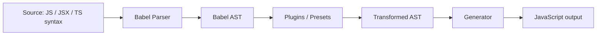

**Is Babel a compiler or a transpiler?** Babel calls itself a compiler; "transpiler" is a useful informal label because its output stays source-level JavaScript rather than machine code.

**Does Babel execute JavaScript or React?** No — Babel only transforms syntax. It turns `<h1>Hello</h1>` into `React.createElement("h1", null, "Hello")` (or the modern JSX runtime equivalent); the browser or Node's engine is what actually *executes* that generated call, and React's own runtime code decides what to do with the result.

**Can Babel replace TypeScript's type checker?** No. Babel's TypeScript preset can *strip and transform* TS syntax into JS, but it does no type analysis — no assignability checks, no inference, nothing. It assumes your TypeScript is already valid.

> **Memory trick:** *Babel transforms source. It never runs it, and it never checks types.*

---

## 10. TypeScript Internals


### 10.1 Scanner → Parser

The **Scanner** turns characters into tokens (`const`, `age`, `:`, `number`, `=`, `21`, `;`). The **Parser** uses grammar rules to build an AST from those tokens:

```
VariableDeclaration
├── name: age
├── type: number
└── initializer: 21
```

Critically: the parser does not create a runtime variable — it creates a *syntactic representation* of one. The actual variable exists only later, when the emitted JavaScript executes.

### 10.2 Binder — What Does It Actually Bind?

**Question:** Why does TypeScript need a Binder if it already has an AST?

The AST only describes *syntax structure*. The Binder walks that AST and creates **Symbols** — compiler metadata linking a *name* to its *declaration(s)* — plus scope relationships between them:

```
age declaration      → Symbol(age)
printAge declaration → Symbol(printAge)
```

This is what lets the Checker later ask "what does the name `age` refer to here, and what are all its declaration sites?" without re-parsing.

> **Memory trick:** *Binder = names → symbols + scopes.*

### 10.3 Checker — Does It Execute My Program?

**No.** The Checker performs pure static analysis: assignability, inference, narrowing, overload resolution, generic constraint solving — and reports **diagnostics**. It never runs a single line of your code.

```ts
const age: number = "hello";
// declared: number, actual: string → not assignable → diagnostic
```

**Interview answer:** *"The Checker is a static reasoning engine — it walks symbols and types to decide whether your code is internally consistent, and reports errors. Nothing here ever executes; execution only happens after emission, in the JS runtime."*

### 10.4 Transformer and Emitter

The Transformer strips type-only syntax and downlevels language features according to your config (e.g., target); the Emitter prints the resulting AST as JavaScript, optionally alongside `.d.ts` declaration files and `.js.map` source maps.

```ts
const add = (a: number, b: number): number => a + b;
```
```js
// possible emit
const add = (a, b) => a + b;
```

> **Memory trick:** *Scanner → tokens. Parser → AST. Binder → symbols. Checker → diagnostics. Transformer/Emitter → JavaScript.*

---

## 11. TypeScript vs. JavaScript: What Survives to Runtime?

```
TypeScript
  │ types, interfaces, generics, annotations — compile-time only
  ↓
JavaScript
  ↓
Runtime
```

**Most TypeScript constructs are erased entirely.** For each one, ask: *what does it mean to the compiler, and what does JavaScript actually receive?*

| Construct | Compiler meaning | Survives to runtime? |
|---|---|---|
| `interface` | Shape contract for static checking | No — fully erased |
| `type` alias | Named type expression | No — fully erased |
| `any` | "Trust me, skip checking this" | N/A — it's an escape hatch, not a value |
| `unknown` | "I don't know yet — narrow before use" | N/A — forces a runtime `typeof`/guard before unsafe use |
| `never` | No value can ever satisfy this type; marks unreachable code / exhaustive checks | N/A |
| Union (`A \| B`) | OR relationship between types | No |
| Intersection (`A & B`) | AND — combine members of both | No |
| Tuple (`[number, string]`) | Fixed-length, position-typed array | No — becomes a plain array at runtime |
| Generics `<T>` | Parametric typing checked at compile time | No — fully erased |
| `enum` (non-`const`) | Named constant set | **Yes** — actually generates a runtime JS object |
| `const enum` | Same, but inlined | No runtime object (values are inlined at usage sites) |

```ts
interface User { name: string; }
```
This produces **zero runtime JavaScript**. It exists purely so the Checker can validate assignments against `{ name: string }` shapes; nothing named `User` exists once compiled.

**Important boundary — types are not validation:**


> **Principle:** *Static types protect assumptions inside your program. Runtime validation protects the boundary where untrusted data enters it.* TypeScript cannot stop a malformed API response from having the wrong shape — only a runtime check can.

> **Memory trick:** *Interfaces disappear. `enum` (non-const) is the exception that actually emits code.*

---

## 12. `tsc` vs. Babel vs. Bundler vs. Runtime vs. Engine

| Dimension | `tsc` | Babel | Bundler | Runtime (Node/Browser) | Engine (V8) |
|---|---|---|---|---|---|
| Type checking | ✅ | ❌ | ❌ | ❌ | ❌ |
| Builds an AST | ✅ | ✅ | Often (via its own parser) | ❌ | ✅ (internally) |
| Syntax transform | ✅ | ✅ | Delegates to compilers/loaders | ❌ | ❌ |
| Code generation | ✅ (emit) | ✅ (generate) | ✅ (bundle output) | ❌ | ✅ (machine code) |
| Handles JSX | Partial (syntax only) | ✅ | Delegates | ❌ | ❌ |
| Handles TS syntax | ✅ (full) | Syntax-only, no checking | Delegates | ❌ | ❌ |
| Executes code | ❌ | ❌ | ❌ | ✅ (hosts execution) | ✅ (actually runs it) |
| Module bundling | ❌ | ❌ | ✅ | ❌ | ❌ |
| Runtime optimization (JIT) | ❌ | ❌ | ❌ | ❌ | ✅ |

**Question:** If Babel transforms React/JSX and `tsc` transforms TypeScript, why isn't Node.js "another compiler"?

Because their responsibilities don't overlap: `tsc` and Babel are **source-transformation tools** that produce JavaScript ahead of time. Node.js is a **host/runtime** — it provides APIs (`fs`, `net`, timers, module resolution) and hands your already-JavaScript code to V8, which does the actual parsing/executing/optimizing. Node can *embed* a compiler-like engine internally, but its job is hosting execution, not source transformation.

---

## 13. Node.js vs. V8

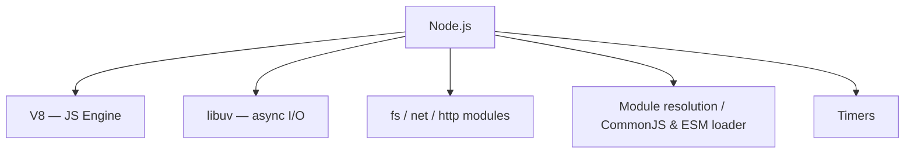

- **V8 = the JavaScript engine.** It can run standalone (V8's own shell, `d8`), completely without Node.
- **Node.js = a runtime built around V8**, adding filesystem, networking, process, and module-loading capabilities that don't exist in a browser.
- Browser JS normally *can't* read local files — not because the language forbids it, but because the **browser host** deliberately doesn't expose that capability (sandboxing/security), whereas Node's host does.

**Interview answer:** *"V8 is the engine that parses and executes JavaScript. Node embeds V8 and wraps it with runtime capabilities — filesystem, networking, timers, module loading — that a browser doesn't expose the same way. So V8 executes; Node provides the environment around it."*

---

## 14. How a TypeScript File Actually Runs

**Workflow A — explicit compile-then-run (most transparent):**
```
.ts → tsc → .js → node → V8 → execution
```

**Workflow B — dev-time runner (transforms on the fly, usually type-strips only):**
```
.ts → tsx / ts-node → in-memory transform → JS execution
```

**Workflow C — frontend framework toolchain:**
```
.tsx → Babel/bundler/framework loader → JavaScript → Browser → Engine
```

**Important nuance:** tools like `tsx`, `ts-node` (in transpile-only mode), esbuild, and Node's native TypeScript type-stripping **do not necessarily run the full type checker**. They strip type syntax fast so the code executes quickly. For an actual type-check with no emit:
```bash
npx tsc --noEmit
```

> **Memory trick:** *Running TS syntax ≠ type-checking it. Only `tsc` (or an IDE using the same checker) verifies types.*

---

## 15. TypeScript Project Setup — What Actually Happens

| Command | What changes on disk | Why |
|---|---|---|
| `npm init -y` | Creates `package.json` | Declares project metadata, scripts, dependency list |
| `npm i -D typescript` | Adds to `package.json` devDependencies, updates `package-lock.json`, installs into `node_modules/typescript` | Makes `tsc` available locally and reproducibly (locked version) |
| `npx tsc --init` | Creates `tsconfig.json` | Declares compiler options for this project |
| `npm i -D @types/node` | Installs Node API **type declarations** into `node_modules` | Lets TypeScript understand `process`, `Buffer`, `fs`, etc. — it does **not** install the Node runtime itself |
| `npm i -D ts-node` | Installs a dev-time TS runner | Lets you execute `.ts` directly without a separate compile step |

`npx tsc` runs the **project-local** compiler binary (from `node_modules/.bin`) rather than a global install — this keeps builds reproducible across machines and CI.

**Answering the common questions:**
- *Can TypeScript run without `package.json`?* Yes — a lone `.ts` file can be compiled/run with a globally or locally available `tsc`/runner; you just lose reproducible dependency management.
- *Can I install TypeScript globally?* Yes, but teams avoid relying on it because a global version can silently drift from what CI or teammates use.
- *Why prefer local `devDependencies`?* Reproducibility: everyone (and CI) resolves the exact same compiler version from the lockfile.

---

## 16. `tsconfig.json` — The Options That Actually Change Compilation

```json
{
  "compilerOptions": {
    "target": "ES2020",
    "module": "ESNext",
    "moduleResolution": "Bundler",
    "rootDir": "src",
    "outDir": "dist",
    "strict": true,
    "esModuleInterop": true,
    "sourceMap": true,
    "declaration": true,
    "noEmit": false
  }
}
```

| Option | Effect |
|---|---|
| `target` | Which JS language-version syntax the Emitter downlevels to (e.g., arrow functions → function expressions for old targets) |
| `module` | Which module system the emitted JS uses (CommonJS, ESNext, etc.) |
| `moduleResolution` | Algorithm used to resolve `import` specifiers to files |
| `rootDir` / `outDir` | Where source lives vs. where compiled JS is written |
| `strict` | Bundles several stricter checks (null checks, implicit `any` bans, etc.) — the single biggest lever for catching real bugs |
| `esModuleInterop` | Smooths over CommonJS/ESM default-import mismatches |
| `sourceMap` | Emits `.js.map` files for debugging |
| `declaration` | Emits `.d.ts` type-declaration files alongside JS, so other TS consumers get your types |
| `noEmit` | Run only for diagnostics; produce no output files (used for CI type-checking) |

```
Source → tsconfig (rules) → Compiler behavior → Output (.js / .d.ts / .js.map)
```

---

## 17. Source Maps and Layered Debugging

**Question:** Why can DevTools show my `.ts` file when the browser only ever executes `.js`?

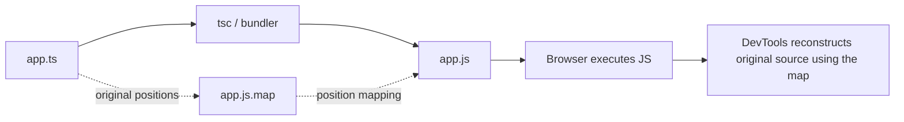

A source map is just metadata: "generated line/column X maps back to original line/column Y in file Z." The browser only ever runs `app.js`; DevTools uses the map purely for *display and breakpoints*.

### Debug by Layer, Not by Guessing

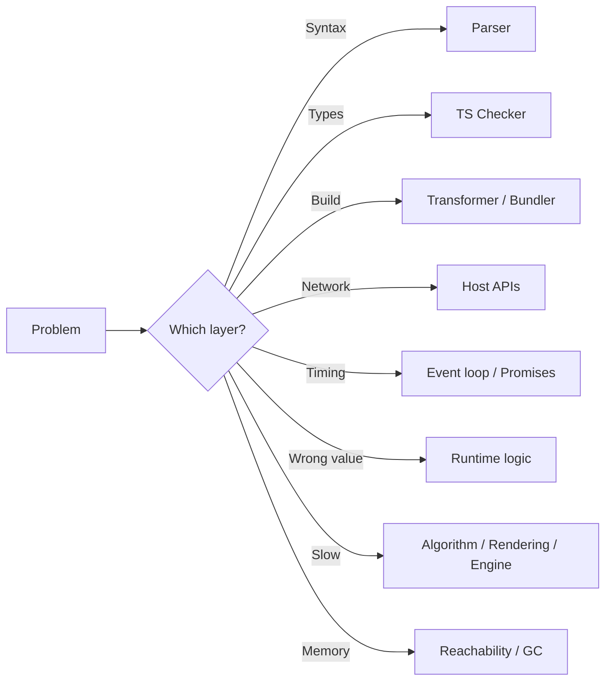

**Debugging loop:**
```
1. Reproduce reliably
2. Observe (logs, breakpoints, profiler — not guesses)
3. Identify which layer owns this behavior
4. Form ONE hypothesis
5. Inspect evidence for/against it
6. Change one thing
7. Reproduce again
8. Add a regression test
```

> If you find yourself editing code repeatedly hoping the error disappears without knowing *why* it appeared — stop. That's the "shallow thinking" trap: you're pattern-matching to a fix instead of finding the layer where the assumption broke.

---

## 18. Incremental Builds — Why One File Change Can Rebuild Many

A project is a **dependency graph**, not a flat pile of files:

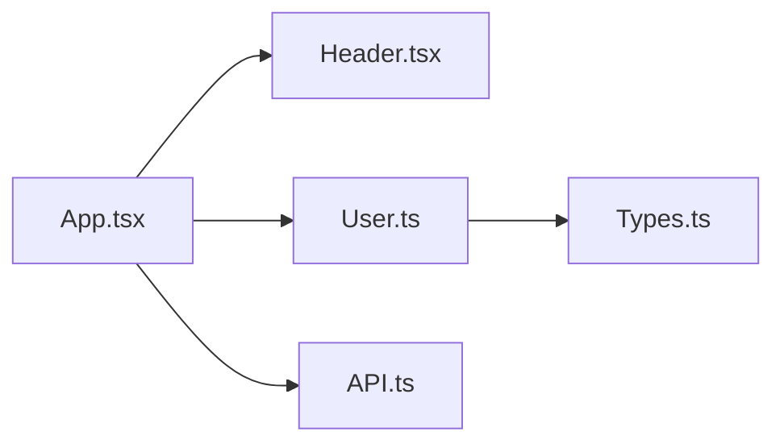

Changing `Types.ts` can force re-checking/re-emitting everything that (transitively) imports it. Modern compilers and bundlers avoid full rebuilds by:
- Caching prior build state (`tsc --incremental`, bundler caches)
- Tracking exactly which modules are "affected" by a change (graph invalidation, not blind re-processing)
- Watch mode diffing only the changed file's dependents

> **Memory trick:** *Rebuild scope is a graph-reachability problem, not a "how many files changed" problem.*

---

## 19. Performance: How Engineers Actually Optimize

**Core principle:** *Measure → identify the bottleneck → form a hypothesis → change one thing → measure again.* Never optimize from a guess.

```
Is the bottleneck actually:
├── network (payload size, round trips)?
├── algorithm (complexity, unnecessary work)?
├── rendering (layout thrashing, excessive re-renders)?
├── memory (leaks, large retained graphs)?
├── serialization (JSON parse/stringify cost)?
├── bundle size (too much shipped JS)?
├── JS execution itself (rare, but shape instability / hot loops)?
└── the actual backend/database?
```

Practical, non-random levers: avoid unnecessary work before micro-optimizing; paginate large data sets; debounce user-driven queries; throttle continuous event sources; keep object shapes stable in hot paths; move heavy CPU work off the main thread (workers) when it genuinely blocks UI; profile memory instead of guessing about GC; measure before touching anything engine-sensitive.

---

## 20. Interview Question Bank (with Model Answers Where It Matters)

### Foundation
- **Does JavaScript have a compiler?** — It's a language; engines choose interpretation/JIT strategies, so "compiled" is an implementation detail, not a spec guarantee.
- **What's the difference between `null`, `undefined`, and undeclared?** `null` = intentional absence; `undefined` = declared/missing value or unset parameter; undeclared = no binding exists at all (throws on read).
- **`var` vs `let` vs `const`** — function-scoped + hoisted-as-undefined vs. block-scoped + TDZ; `const` additionally forbids reassignment (not deep immutability).
- **`==` vs `===`** — loose (coerces types before comparing) vs. strict (no coercion).
- What is the event loop? What is event delegation? Why does `this` behave the way it does in a given call form?

### Intermediate
- What is a closure, and why would you use one? (private state, factories, memoization).
- Promises vs. callbacks — pros/cons (composability, error propagation vs. callback-hell/inversion-of-control issues).
- CommonJS vs. ES Modules — synchronous `require` + dynamic shape vs. static, analyzable `import`/`export` graph (enables tree shaking).
- Mutable vs. immutable objects; shallow vs. deep copy.
- What are getters/setters for? What is `Object.freeze()` vs. `Object.seal()`?

### Advanced
- **What is JIT compilation, and why does the engine optimize while the program runs?** It compiles based on observed real usage patterns rather than static worst-case assumptions, then falls back (deoptimizes) if those patterns change.
- **What are hidden classes/shapes and inline caches?** Internal structural typing + lookup caching that make dynamic property access fast when object shapes stay stable.
- **How does garbage collection know an object is unused?** It doesn't track "unused" — it tracks *reachability* from roots; unreachable objects become eligible for reclamation.
- What are iterators/generators used for? What are Proxies for? What are `WeakMap`/`WeakSet` for (GC-friendly keying)?

### Senior / Systems-Level
- **Why does `Promise.then()` usually run before `setTimeout(fn, 0)`?** Job-completion + full microtask drain happens before the next macrotask is picked up.
- **Does `async/await` create a new thread?** No — it's syntax over the same Promise/microtask machinery; JS stays single-threaded on one execution agent per turn.
- **Where does `fetch()` actually execute?** In host-provided networking code, not in the JS engine itself; the engine only runs the JS that calls it and reacts to its Promise.
- **Is the DOM part of JavaScript?** No — it's a browser-provided API/data model that JS can read and mutate.
- **Why can changing one module trigger a large rebuild?** Dependency-graph invalidation, not per-file rebuilding.
- **Why does TypeScript need both a Binder and a Checker if it already has an AST?** The AST is pure syntax; the Binder attaches meaning (symbols/scopes) to names; the Checker then reasons about types using those symbols. Splitting these lets each phase stay focused and reusable (e.g., the Binder's symbol table is also what tooling like "Go to Definition" relies on).
- **Why do interfaces disappear at runtime but `enum` doesn't?** Interfaces are pure compile-time contracts with no runtime representation; non-const `enum` is specified to also generate an actual JS object mapping names to values, which some code may rely on at runtime (e.g., reverse lookups).
- **What does `target` change? What does `strict` change?** `target` controls syntax downleveling for older JS engines; `strict` bundles several independently-toggleable checks (`strictNullChecks`, `noImplicitAny`, etc.) that catch a large share of real bugs.
- How would you debug an unexpected async ordering issue? (Identify task vs. microtask sources; trace what schedules what; don't assume "Promises always win.")
- How would you investigate a memory leak in production? (Heap snapshots over time, retainer paths, reachability — not just "watch memory grow.")

---

## 21. Final Architecture Map

```
SOURCE
 ↓
LEXER / TOKENS
 ↓
PARSER / AST
 ↓
BINDER / SYMBOLS        (TypeScript only)
 ↓
CHECKER / TYPES         (TypeScript only — diagnostics, no execution)
 ↓
TRANSFORMER / EMITTER   (tsc and/or Babel)
 ↓
JAVASCRIPT
 ↓
BUNDLER (when applicable — module graph, tree shaking, code splitting)
 ↓
RUNTIME  ──────────────┬───────────────
 ↓                     ↓
BROWSER              NODE.JS
 (DOM, Web APIs,       (fs, net, timers,
  rendering,            module loader)
  event loop)
 ↓                     ↓
 └────────── V8 / JAVASCRIPT ENGINE ────────────┘
 ↓
CALL STACK / EXECUTION CONTEXTS
 ↓
MEMORY (heap, reachability, GC)
 ↓
ASYNC (microtasks / macrotasks / event loop)
 ↓
JIT / RUNTIME FEEDBACK / OPTIMIZATION / DEOPTIMIZATION
 ↓
CPU
```

### The Full Story: `const x: number = 10;` → CPU

1. **Scanner** turns the text into tokens; **Parser** builds an AST node for a typed variable declaration.
2. **Binder** creates a `Symbol(x)` and records its scope.
3. **Checker** confirms `10` is assignable to `number`; if not, it emits a diagnostic and stops here (no execution ever happens for a failed check).
4. **Transformer/Emitter** strips the `: number` annotation (compile-time only) and prints `const x = 10;` as plain JavaScript, optionally alongside a source map.
5. A **bundler**, if present, folds this module into a dependency graph and produces deployable output.
6. **Node.js or a browser** loads that JavaScript and hands it to **V8**.
7. V8 **parses** it, creates an **execution context**, and runs it on the **call stack**.
8. The value `10` is allocated on the heap/stack as the engine sees fit; it stays reachable as long as `x`'s binding (or any closure over it) is reachable.
9. If this line runs inside a hot loop, V8 collects **runtime feedback**, may **optimize** it, and would **deoptimize** if a later assumption (e.g., about the variable's type) breaks.
10. Eventually the underlying machine code executes on the **CPU**.

That's the complete path — from a single typed declaration, through two distinct pipelines (TypeScript's compiler and JavaScript's engine), down to actual instruction execution.