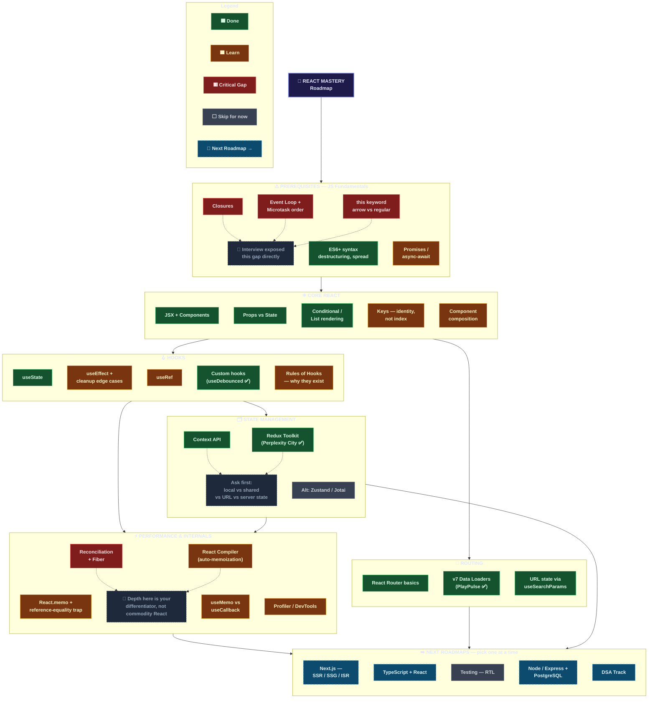

# ⚛️ React Mastery Roadmap

> A practical roadmap from **JavaScript fundamentals → Core React → Hooks → State Management → Performance & Internals → Routing → Next.js / TypeScript / Backend / DSA**.
>
> **Legend:** 🟩 Done · 🟧 Learn · 🟥 Critical Gap · ⬜ Skip for now · 🔵 Next Phase

---

## 🗺️ Visual Roadmap

GitHub renders Mermaid diagrams natively, so this roadmap stays **version-control friendly and readable** instead of being a static image.



---

# 🔗 Study Directly From the Roadmap

> **Workflow:** click a resource → study → implement → break it → debug it → explain it → update the status.

## 🟥 Prerequisites — JavaScript Fundamentals

| Status | Topic | Master | Study |
|---|---|---|---|
| 🟥 | **Closures** | Lexical scope, closure creation, private state, stale closures | [MDN — Closures](https://developer.mozilla.org/en-US/docs/Web/JavaScript/Guide/Closures) |
| 🟥 | **Event Loop + Microtasks** | Call stack, task queue, microtask queue, Promise ordering | [MDN — Execution Model](https://developer.mozilla.org/en-US/docs/Web/JavaScript/Reference/Execution_model) |
| 🟥 | **`this` keyword** | Call-site, methods, arrow vs regular functions, `bind/call/apply` | [MDN — `this`](https://developer.mozilla.org/en-US/docs/Web/JavaScript/Reference/Operators/this) |
| 🟩 | **ES6+ syntax** | Destructuring, spread/rest, modules, template literals, optional chaining | [MDN — JavaScript Guide](https://developer.mozilla.org/en-US/docs/Web/JavaScript/Guide) |
| 🟧 | **Promises / async-await** | Promise states, chaining, errors, concurrency, `async/await` | [MDN — Promise](https://developer.mozilla.org/en-US/docs/Web/JavaScript/Reference/Global_Objects/Promise) · [MDN — async function](https://developer.mozilla.org/en-US/docs/Web/JavaScript/Reference/Statements/async_function) |

### Prerequisite checkpoint

You should be able to explain:

```text
Closure
   ↓
Function remembers its lexical environment

Promise
   ↓
Represents future completion/failure

Microtask
   ↓
Runs after the current stack before the next task

this
   ↓
Primarily depends on how a function is called
```

---

# ⚛️ Core React

| Status | Topic | Master | Study |
|---|---|---|---|
| 🟩 | **JSX + Components** | JSX, function components, props, component boundaries | [React — Describing the UI](https://react.dev/learn/describing-the-ui) |
| 🟩 | **Props vs State** | One-way data flow, local state, immutable updates | [React — Passing Props](https://react.dev/learn/passing-props-to-a-component) · [React — State](https://react.dev/learn/state-a-components-memory) |
| 🟩 | **Conditional / List Rendering** | Conditions, `.map()`, keys, collections | [React — Conditional Rendering](https://react.dev/learn/conditional-rendering) · [React — Rendering Lists](https://react.dev/learn/rendering-lists) |
| 🟧 | **Keys — identity, not index** | Stable identity, reconciliation, why indexes can be dangerous | [React — Keeping List Items in Order](https://react.dev/learn/rendering-lists#keeping-list-items-in-order-with-key) |
| 🟧 | **Component Composition** | `children`, reusable boundaries, composition | [React — Passing Props](https://react.dev/learn/passing-props-to-a-component) |

### Core checkpoint

Before moving forward, answer:

1. Why does a component re-render?
2. Props vs state?
3. Why are keys needed?
4. Why are stable IDs usually better than indexes?
5. How does data move parent → child?
6. When should state move up or stay local?

---

# 🪝 Hooks

| Status | Hook / Topic | Master | Study |
|---|---|---|---|
| 🟩 | **`useState`** | State, updates, functional updates, immutable updates | [React — useState](https://react.dev/reference/react/useState) |
| 🟧 | **`useEffect`** | Effects, dependencies, cleanup, synchronization, stale closures | [React — useEffect](https://react.dev/reference/react/useEffect) |
| 🟧 | **`useRef`** | Persistent mutable values, DOM refs, previous values, timers | [React — useRef](https://react.dev/reference/react/useRef) |
| 🟩 | **Custom Hooks** | Reusing stateful logic and composing Hooks | [React — Custom Hooks](https://react.dev/learn/reusing-logic-with-custom-hooks) |
| 🟧 | **Rules of Hooks** | Stable Hook order and top-level calls | [React — Rules of Hooks](https://react.dev/reference/rules/rules-of-hooks) |

## Hook mental model

```text
useState
    ↓
"Remember UI state."

useEffect
    ↓
"Synchronize with something outside React."

useRef
    ↓
"Remember a mutable value without re-rendering."

Custom Hook
    ↓
"Package reusable stateful logic."

Rules of Hooks
    ↓
"Keep Hook calls predictable."
```

### Hook checkpoint

Understand this sequence:

```text
render
  ↓
state update
  ↓
re-render
  ↓
dependency comparison
  ↓
effect setup
  ↓
cleanup when synchronization changes/stops
```

---

# 🗂️ State Management

| Status | Topic | Master | Study |
|---|---|---|---|
| 🟩 | **Context API** | Provider, consumer, shared data, re-render implications | [React — useContext](https://react.dev/reference/react/useContext) |
| 🟩 | **Redux Toolkit** | Store, slice, reducer, action, dispatch, selector, middleware | [Redux Toolkit](https://redux-toolkit.js.org/) |
| ⬜ | **Zustand / Jotai** | Alternatives and trade-offs; don't learn everything simultaneously | [Zustand](https://zustand.docs.pmnd.rs/) · [Jotai](https://jotai.org/) |

## State decision framework

```text
Only one component?
        ↓
    useState

Shared by a bounded subtree?
        ↓
    Context / lifted state

Complex state transitions?
        ↓
    useReducer

Application-wide client state?
        ↓
    Redux Toolkit / external store

Server-owned data?
        ↓
    Server-state/data-fetching solution

Bookmarkable/shareable filter?
        ↓
    URL state
```

> **Do not choose a state library because it is popular. Choose it because the state ownership problem requires it.**

---

# ⚡ Performance & Internals

This is the section designed to move you beyond **commodity React**.

| Status | Topic | Master | Study |
|---|---|---|---|
| 🟧 | **`React.memo` + reference equality** | Prop comparison, object/function identity, unnecessary renders | [React — memo](https://react.dev/reference/react/memo) |
| 🟧 | **`useMemo` vs `useCallback`** | Cached values vs functions, dependencies, identity | [useMemo](https://react.dev/reference/react/useMemo) · [useCallback](https://react.dev/reference/react/useCallback) |
| 🟥 | **Reconciliation + Fiber** | Render vs commit, reconciliation, identity, scheduling | [React — Render and Commit](https://react.dev/learn/render-and-commit) |
| 🟧 | **React Compiler** | Automatic memoization and compiler-driven optimization | [React Compiler](https://react.dev/learn/react-compiler/introduction) |
| 🟧 | **Profiler / DevTools** | Find real rendering bottlenecks instead of guessing | [React Developer Tools](https://react.dev/learn/react-developer-tools) |

## Performance mental model

```text
Don't optimize because a Hook exists.

Measure
   ↓
Find bottleneck
   ↓
Understand cause
   ↓
Change one thing
   ↓
Measure again
```

### Reference equality

```js
10 === 10                 // true
{} === {}                 // false
[] === []                 // false
(() => {}) === (() => {}) // false
```

Therefore:

```text
new object
new array
new function
      ↓
new reference
      ↓
possible prop/dependency change
      ↓
possible extra work
```

---

# 🧭 Routing

| Status | Topic | Master | Study |
|---|---|---|---|
| 🟩 | **React Router basics** | Routes, nested routes, params, navigation, layouts | [React Router](https://reactrouter.com/) |
| 🟩 | **v7 Data Loaders** | Loaders, actions, pending UI, route-level data | [React Router — Data Loading](https://reactrouter.com/start/framework/data-loading) |
| 🟩 | **URL state / `useSearchParams`** | Query parameters, shareable filters, browser navigation | [useSearchParams](https://reactrouter.com/api/hooks/useSearchParams) |

---

# ➡️ Next Roadmaps

> **Pick ONE. Do not start all five simultaneously.**

| Status | Track | Why | Study |
|---|---|---|---|
| 🔵 | **Next.js — SSR / SSG / ISR** | Full-stack React and rendering strategies | [Next.js Docs](https://nextjs.org/docs) · [Rendering Strategies](https://nextjs.org/learn/seo/rendering-strategies) |
| 🔵 | **TypeScript + React** | Type-safe production React | [TypeScript — React](https://www.typescriptlang.org/docs/handbook/react.html) |
| ⬜ | **Testing — RTL** | Reliable UI behavior and regression protection | [Testing Library — React](https://testing-library.com/docs/react-testing-library/intro/) |
| 🔵 | **Node / Express + PostgreSQL** | Backend engineering and full-stack systems | [Node.js](https://nodejs.org/docs/latest/api/) · [Express](https://expressjs.com/) · [PostgreSQL](https://www.postgresql.org/docs/) |
| 🔵 | **DSA Track** | Algorithms, problem solving, interview reasoning | [NeetCode](https://neetcode.io/) |

---

# 📚 How to Study Every Topic

For every roadmap item:

### 1. Understand

Ask:

```text
What problem does this solve?
Why does it exist?
What happens during execution?
```

### 2. Implement

Build the smallest working example.

### 3. Break it

Intentionally create:

```text
Wrong dependency
Missing cleanup
Mutated state
Unstable object
Unstable callback
Wrong key
```

### 4. Debug

Before asking AI:

```text
What did I expect?
What actually happened?
At which step did behavior diverge?
```

### 5. Explain

If you cannot explain it without looking at notes, you don't fully own it yet.

---

# 🧪 Completion Criteria

Don't mark a topic **Done** because you watched a tutorial.

## 🟩 Done

You can:

- Explain it in your own words
- Build a small feature using it
- Debug a common failure
- Explain when **not** to use it
- Explain trade-offs
- Defend the decision in an interview

## 🟧 Learn

You understand the basics but need more:

- Implementation
- Debugging
- Edge cases
- Interview practice

## 🟥 Critical Gap

The topic can cause problems in:

- Interviews
- Debugging
- React internals
- Production architecture
- Understanding related concepts

## ⬜ Skip for now

Not useless.

It means:

> **Not the highest-return topic for the current learning phase.**

---

# 🎯 Interview Defense Checklist

For every major React concept:

```text
1. What is it?

2. Why does it exist?

3. How does it work?

4. When would you use it?

5. When would you NOT use it?
```

For performance topics:

```text
6. What problem does it optimize?

7. How would you prove the optimization helped?
```

For state management:

```text
8. Who owns this state?

9. Why is it local/shared/server/URL state?
```

---

# 🔬 React System Thinking

Don't see React as a collection of APIs:

```text
useState
useEffect
useMemo
useCallback
Redux
Router
```

See the system:

```text
                    USER
                      │
                      ↓
                  INTERACTION
                      │
                      ↓
                 STATE UPDATE
                      │
                      ↓
                 RE-RENDER
                      │
              ┌───────┴───────┐
              ↓               ↓
         COMPONENT          HOOKS
            LOGIC             │
              │        ┌──────┼──────┐
              │        ↓      ↓      ↓
              │      state   ref    memo
              │
              ↓
             JSX
              │
              ↓
          RECONCILIATION
              │
              ↓
            COMMIT
              │
              ↓
          BROWSER UI
              │
              ↓
       EXTERNAL SYSTEMS
              │
              ↓
           EFFECTS
```

The goal is to understand:

**data flow + ownership + identity + synchronization + rendering + trade-offs**

---

# 🚦 Current Priority

If following this roadmap now:

```text
🟥 Closures
🟥 Event Loop + Microtasks
🟥 this
      ↓
🟧 useEffect + dependency/cleanup edge cases
      ↓
🟧 Component composition
      ↓
🟧 Rules of Hooks
      ↓
🟧 React.memo + reference equality
      ↓
🟥 Reconciliation + Fiber
      ↓
🟧 useMemo vs useCallback
      ↓
🟧 Profiler / DevTools
      ↓
🔵 Pick ONE next roadmap
```

---

# 🏁 Definition of React Mastery

You are moving from **React user → React engineer** when you stop asking:

> "Which Hook should I use?"

and start asking:

> "Who owns this data?"

> "What causes this render?"

> "What external system am I synchronizing with?"

> "Is this state actually necessary?"

> "Is this value derived?"

> "Does identity matter here?"

> "Why is this component rendering again?"

> "What is the bottleneck?"

> "Can I prove this optimization helped?"

> "What trade-off am I making?"

That shift in questions is the real roadmap.

---

## 🔗 Official React References

- [React Documentation](https://react.dev/)
- [Built-in React Hooks](https://react.dev/reference/react/hooks)
- [React APIs](https://react.dev/reference/react)
- [Rules of Hooks](https://react.dev/reference/rules/rules-of-hooks)
- [React Developer Tools](https://react.dev/learn/react-developer-tools)

---

**Last updated:** 2026-09-02

**Current focus:** React fundamentals → Hooks → Performance & Internals

**Rule:** Learn one layer deeply before jumping to the next.
