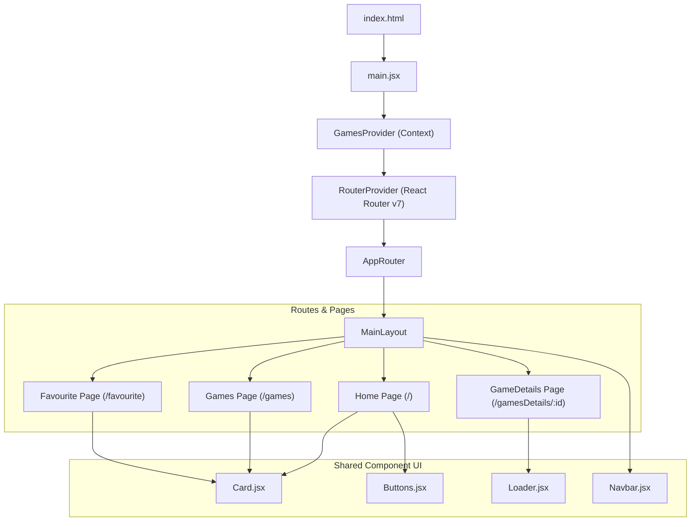
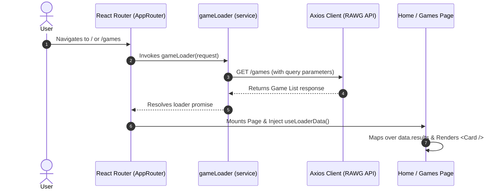
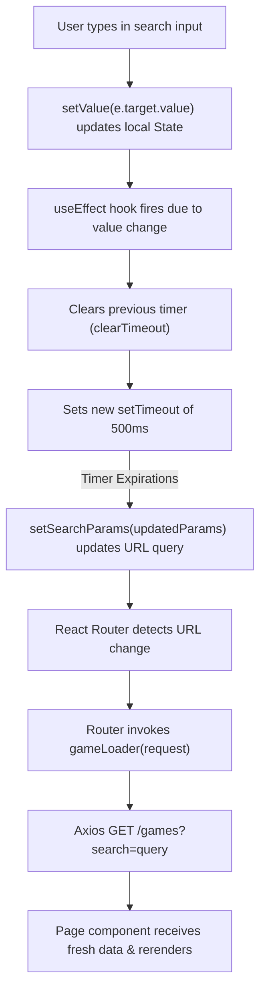
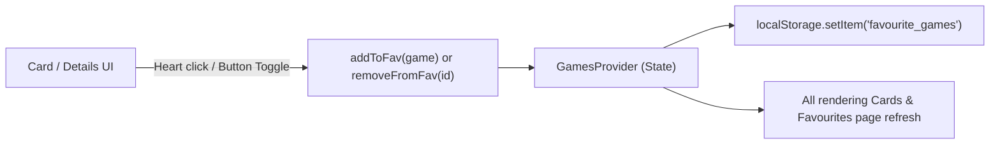
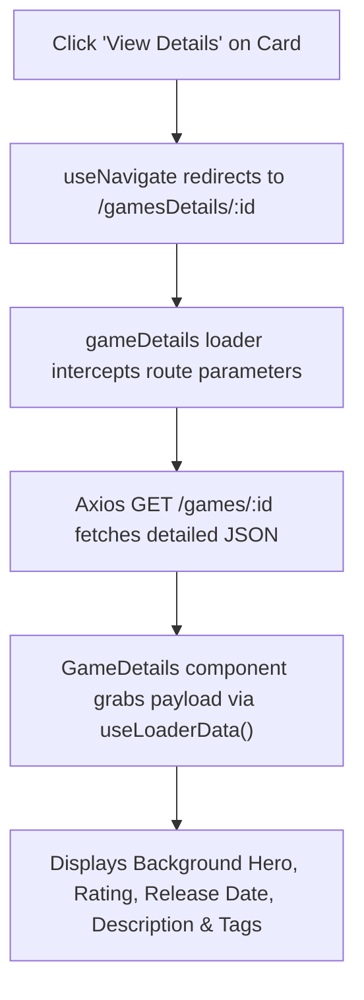

# 🎮 GameList - Full Flow Analysis & React Revision Manual

A high-performance, dark-themed, and responsive web application built with **React 19**, **React Router v7 (Data Loading paradigm)**, and **Tailwind CSS v4.0**. The app integrates with the [RAWG Video Games Database API](https://rawg.io/apidocs) to allow users to search, browse, view detailed information, and manage a personalized list of favorite games.

This document serves as a complete analysis of the system architecture, feature flows, pitfalls resolved, and critical learnings for React developers.

---

## 🗺️ System Architecture & Route Hierarchy

The application adopts a modular architecture separating presentation components, state contexts, data-loading services, and layouts.

### Component & Folder Structure
- **[config/api.js](file:///c:/Users/Lenovo/OneDrive/Downloads/Documents/Window/cohort/revision/game/src/config/api.js)**: Configures the base Axios client.
- **[service/GameLoader.jsx](file:///c:/Users/Lenovo/OneDrive/Downloads/Documents/Window/cohort/revision/game/src/service/GameLoader.jsx)**: Implements React Router loaders to pre-fetch API data before rendering pages.
- **[context/Gamescontext.jsx](file:///c:/Users/Lenovo/OneDrive/Downloads/Documents/Window/cohort/revision/game/src/context/Gamescontext.jsx)**: Coordinates global favorites state and handles persistence in `localStorage`.
- **[layout/MainLayout.jsx](file:///c:/Users/Lenovo/OneDrive/Downloads/Documents/Window/cohort/revision/game/src/layout/MainLayout.jsx)**: Wraps all pages in a persistent layout, containing the global [Navbar](file:///c:/Users/Lenovo/OneDrive/Downloads/Documents/Window/cohort/revision/game/src/Components/Navbar.jsx).



---

## 🔄 Feature Flow & Code Deep Dives

### 1. Unified Game Listing Flow (`/` & `/games` Routes)
The listing pages fetch game directories directly from RAWG. Rather than loading data imperatively inside pages via `useEffect`, the application utilizes React Router's native data loading engine.



#### Core Code Snapshot:
In **[AppRoutes.jsx](file:///c:/Users/Lenovo/OneDrive/Downloads/Documents/Window/cohort/revision/game/src/AppRoutes.jsx)**:
```javascript
{
  path: "games",
  element: <Games />,
  loader: gameLoader
}
```
In **[GameLoader.jsx](file:///c:/Users/Lenovo/OneDrive/Downloads/Documents/Window/cohort/revision/game/src/service/GameLoader.jsx)**:
```javascript
export const gameLoader = async ({ request }) => {
  const url = new URL(request.url);
  const search = url.searchParams.get("search") || "";
  const params = {};

  if (search) params.search = search;

  // Resolves the promise before rendering the page component
  const res = await api.get("/games", { params });
  return res;
};
```

---

### 2. Debounced Search Synchronization Flow
The application synchronizes the search state with the browser's URL query string. Typing instantly updates the local state (giving instant UI feedback) and triggers a debounced timer. Once typing pauses for `500ms`, the URL is updated, which automatically triggers React Router to run the `gameLoader` and refresh page data.



#### Core Code Snapshot:
In **[Navbar.jsx](file:///c:/Users/Lenovo/OneDrive/Downloads/Documents/Window/cohort/revision/game/src/Components/Navbar.jsx)**:
```javascript
const [searchParams, setSearchParams] = useSearchParams();
const [value, setValue] = useState(searchParams.get("search") || "");

useEffect(() => {
  // Setup debouncing timer
  const timer = setTimeout(() => {
    setSearchParams((prev) => {
      const params = new URLSearchParams(prev);
      if (value) {
        params.set("search", value);
      } else {
        params.delete("search");
      }
      params.set("page", 1); // Reset page on search
      return params;
    });
  }, 500);

  // Clean-up: cancels previous timer on next keystroke
  return () => clearTimeout(timer);
}, [value]);
```

---

### 3. Persisted Favorites Management (Global Context)
Adding or removing favorites updates a centralized context, which synchronously saves changes to the browser's `localStorage`. This makes the favorites state reactive across the entire application.



#### Core Code Snapshot:
In **[Gamescontext.jsx](file:///c:/Users/Lenovo/OneDrive/Downloads/Documents/Window/cohort/revision/game/src/context/Gamescontext.jsx)**:
```javascript
export const GamesDataContext = createContext();

const GamesProvider = ({ children }) => {
  // Lazy initializer reads from localStorage on load
  const [favourite, setFavourite] = useState(() => {
    const saved = localStorage.getItem("favourite_games");
    return saved ? JSON.parse(saved) : [];
  });

  // Keep localStorage updated with state changes
  useEffect(() => {
    localStorage.setItem("favourite_games", JSON.stringify(favourite));
  }, [favourite]);

  const addToFav = (game) => {
    setFavourite((prev) => {
      const exists = prev.find((item) => String(item.id) === String(game.id));
      if (exists) return prev;
      return [...prev, game];
    });
  };

  const removeFromFav = (id) => {
    setFavourite((prev) => prev.filter((item) => String(item.id) !== String(id)));
  };

  return (
    <GamesDataContext.Provider value={{ favourite, addToFav, removeFromFav }}>
      {children}
    </GamesDataContext.Provider>
  );
};
```

---

### 4. Detailed Information Fetch Flow (`/gamesDetails/:id` Route)
When navigating to the detailed page, the application pulls dynamic data from the single game RAWG endpoint.



---

## ⚠️ Challenges, Pitfalls & Solutions

During development, several architectural and UI/UX challenges were encountered and successfully addressed:

### A. Event Bubbling & Propagation in Card Interactions
> [!WARNING]
> **Problem:** The `<Card />` container has an `onClick` that triggers detail page navigation (`goToDetails`). Inside the card, there is a floating heart button for favorites (`handleFavouriteClick`). Clicking the heart button was bubbling up to the card, triggering navigation *instead* of just updating the favorite status.
>
> **Solution:** Prevented event propagation by adding `e.stopPropagation()` inside the favorite button click handler.
```javascript
const handleFavouriteClick = (e) => {
  e.stopPropagation(); // Prevents navigating to the details page
  if (isFavourite) {
    removeFromFav(items.id);
  } else {
    addToFav(items);
  }
};
```

### B. Keyboard Spams & API Rate Limits in Search Bar
> [!IMPORTANT]
> **Problem:** Standard search inputs trigger queries on every single keystroke. For a word like `"Witcher"`, this triggers 7 sequential HTTP requests, slowing down the interface and exhausting RAWG API limits.
>
> **Solution:** Debouncing using a `setTimeout` inside `useEffect` (as shown in the Navbar flow). The clean-up function clears the timeout on every new stroke before the 500ms delay passes, ensuring only the finalized input triggers a network query.

### C. URL Query & UI Desynchronization
> [!NOTE]
> **Problem:** Keeping the search input value synchronised with browser back/forward buttons or direct link sharing.
>
> **Solution:** Reading directly from the query parameter to set the state's initial value: `const [value, setValue] = useState(searchParams.get("search") || "");`. This binds the search input directly to the URL lifecycle.

### D. Safe Type Comparisons
> [!TIP]
> **Problem:** The game IDs returned from the RAWG API and router params sometimes vary between `String` and `Number` types (e.g., `420` vs `"420"`), causing simple checks like `item.id === id` to fail silently.
>
> **Solution:** Enforced explicit typecasting during comparisons: `String(item.id) === String(id)`.

---

## 🎓 Core React & Web Development Learnings (Revision Guide)

### 1. React Router Data Loading vs. Imperative fetching
- **Traditional (Imperative):** Component mounts -> shows loading spinner -> fires `useEffect` -> updates state -> triggers rerender. This can cause visual layout shifts.
- **Loader (Declarative):** The Router fetches the data *in parallel* with route resolution. The page only transition-renders when data resolves, which provides a cleaner user experience.

### 2. The Power of `useEffect` Cleanup Functions
In React, if you return a function inside a `useEffect`, it is called right before the component unmounts and before running the effect code again. This is essential for:
- Clearing timers (`clearTimeout`, `clearInterval`).
- Aborting active HTTP requests (`AbortController`).
- Removing event listeners.

### 3. URL as the Single Source of Truth
Instead of storing filtering, paginating, and searching filters inside local React states, store them in URLs (`?search=val&page=2`).
- **Benefits:**
  - Standard back/forward browser button navigation works.
  - Users can share or bookmark the page and see the exact same view.
  - Prevents stale component state bugs.

### 4. Tailwind CSS v4.0 (Vite CSS-first integration)
Tailwind v4 is integrated directly in this project via `@tailwindcss/vite`.
- No `tailwind.config.js` is needed. Configuration is written directly in CSS using `@theme` syntax inside the CSS entry point.
- CSS layers (`@layer base`) are used for setting up background colors and base elements cleanly.

---

## 🛠️ Local Environment & Launch Guide

### Requirements
Ensure you have a RAWG API Key. Register at [RAWG.io](https://rawg.io/apidocs).

### 1. Set Up Environment Variables
Create a file named `.env` in the root directory (make sure it is not committed to git):
```env
VITE_RAWG_API_KEY=your_rawg_api_key_here
```

### 2. Run the Application
Run the following commands in your shell:
```bash
# Install dependencies
npm install

# Run the dev server
npm run dev
```

The server will spin up locally (typically at `http://localhost:5173`). Enjoy exploring!
